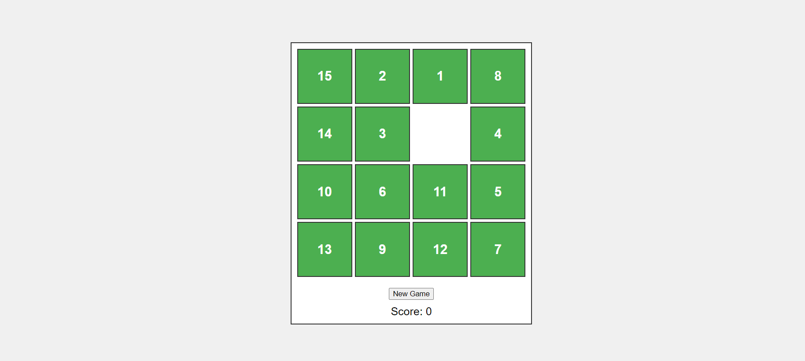

# **15-Puzzle Game** 

---

 

## **Description 📃**
<!-- add your game description here  -->
- The 15-Puzzle Game is a classic sliding puzzle game played on a 4x4 grid with 15 numbered tiles and one empty space. The objective is to reorder the tiles in numerical sequence, from 1 in the top-left corner to 15 in the bottom-right corner, by sliding tiles into the empty space.

## **Functionalities 🎮**
<!-- add functionalities over here -->
- 4x4 grid layout with 15 numbered tiles and one empty space.
- Ability to slide tiles into the adjacent empty space.
- Score counter to track the number of moves made.
- "New Game" button to reset the grid and score.
- Winning condition: Arrange tiles in numerical order from 1 to 15.

 

## **How to play? 🕹️**
<!-- add the steps how to play games -->
- Start the game by clicking the "New Game" button.
- Click on a tile adjacent to the empty space to slide it into the empty space.
- Continue sliding tiles to rearrange them in numerical order.
- The game is won when the tiles are ordered from 1 to 15, starting from the top-left corner to the bottom-right corner.
- The score (number of moves) is displayed and updated with each tile movement.

 

## **Screenshots 📸**

 

 
