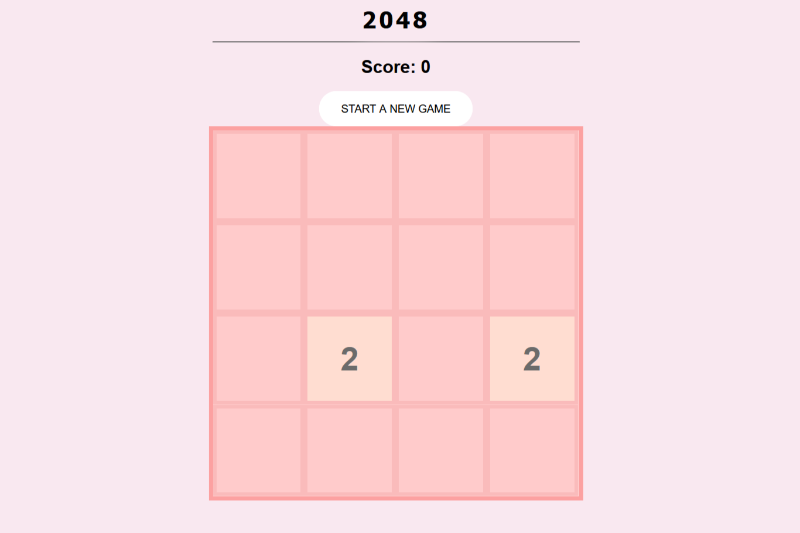

# **Game_Name** 
2048
---

 

## **Description 📃**
<!-- add your game description here  -->
2048 is a puzzle game where you merge numbers together to create larger numbers. The goal of the game is to reach the number 2048. However, it is possible to reach even higher numbers. The highest possible number is 131,072.
- 

## **functionalities 🎮**
<!-- add functionalities over here -->
2048 is played on a plain 4×4 grid, with numbered tiles that slide when a player moves them using the four arrow keys.Every turn, a new tile randomly appears in an empty spot on the board with a value of either 2 or 4. If two tiles of the same number collide while moving, they will merge into a tile with the total value of the two tiles that collided. 
- 
 

## **How to play? 🕹️**
<!-- add the steps how to play games -->
-Player use 4 arrow keys on the keyboard to move the tiles- 1.UP 2.DOWN 3.RIGHT 4.LEFT 
-In this game, the player must combine tiles containing the same numbers until they reach the number 2048.
-The tiles can contain only integer values starting from 2, and that are a power of two, like 2, 4, 8, 16, 32, and so on.
-The board has dimension of 4 x 4 tiles, so that it can fit up to 16 tiles. If the board is full - the game is over.
- 

 

## **Screenshots 📸**

 
<!-- add your screenshots like this -->

 
