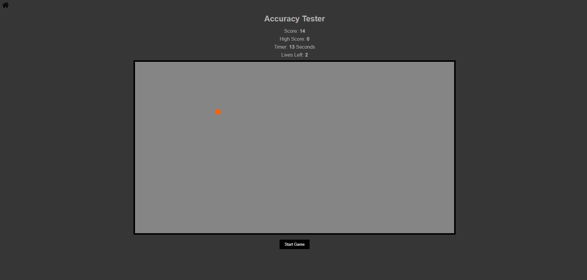

# **Game_Name** 

Accuracy Tester
--- 
 

## **Description 📃**
<!-- add your game description here  -->
- Accuracy Tester is a simple gain to test the player's accuracy. The  opjective is to click on as many circles as possible, and if a circle is missed the player will lose one of their three lives. A circle will appear on screen randomly then start disappearing the player must click the circle fast enough or else they will lose a life. If the player clicks the circle in time they will gain a point and another circle will spawn. 

- To start the player must press the start button.

- A circle will appear on screen and must be clicked quickly.

- The player's goal is to click on the circles in time.

- Overall, the will test a players accuracy and speed.

## **functionalities 🎮**
<!-- add functionalities over here -->
- Cicles will appear opn screen randomly and will disappear if not clicked fast enough.
- Players can click the circles to get points.
- The player's score is displayed in real-time, along with how long they have been playing, their high score, and the amount of lives they have left.
- The game will end if a players lives hit zero.
 

## **How to play? 🕹️**
<!-- add the steps how to play games -->
- Click the Start Game button

 

## **Screenshots 📸**

 
<!-- add your screenshots like this -->
<!--  -->
    
 

<!-- add your working video over here -->