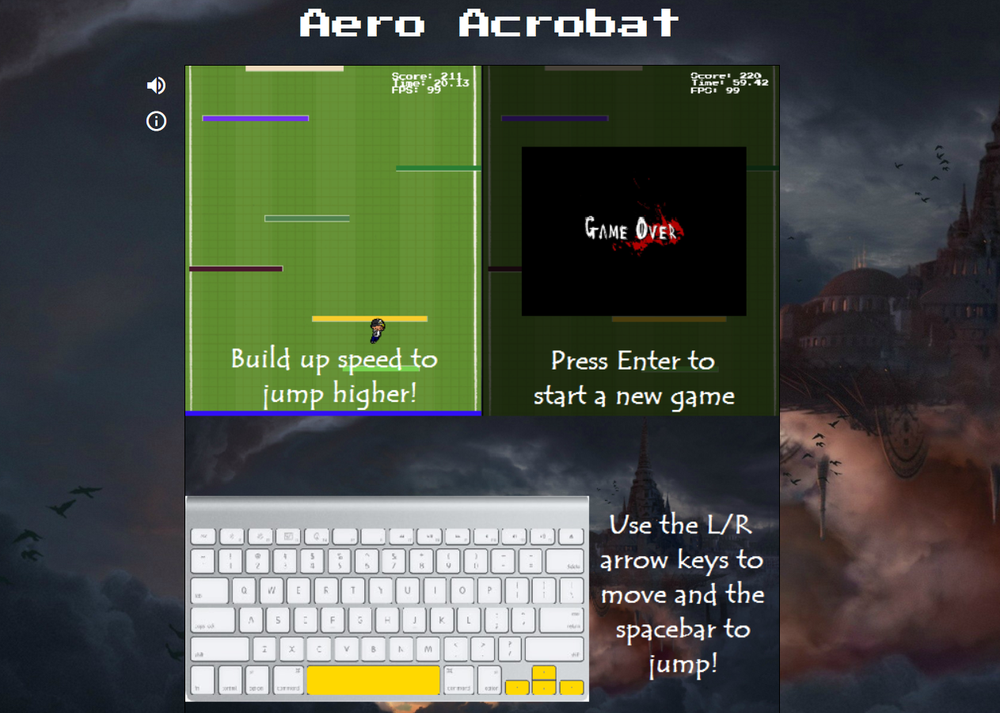

# **Game_Name** 
Aero_Acrobat
---

 

## **Description 📃**
<!-- add your game description here  -->
"Aero Acrobat" is an exhilarating arcade-style game that challenges players to navigate a courageous boy through a breathtaking ascent into the sky. With the help of the spacebar and four arrow keys, players must guide the boy upwards, maneuvering through a maze of obstacles and platforms.
- 

## **functionalities 🎮**
<!-- add functionalities over here -->
* Aero Acrobat uses the requestAnimationFrame function built into
modern browsers in order to maintain a consistent refresh rate that makes
for a more enjoyable experience.  The game is also updated with specific
tick intervals to maintain more consistent position updating of the avatar.

* The game is rendered using HTML Canvas.  The entire background image
is rendered with platforms drawn onto it with styling set to overflow: hidden
which only shows the 600x700 pixels that the game should.  In order to move
the background, the built in scrollTop feature was used to center the
canvas to the avatar's position.

* As the game updated roughly 60 times per second, tick rates were used
to determine the rate at which platforms were removed.  tickCount was incremented
with each call of tick by GameView and platforms were removed when it
reached a certain threshold.  This simplified the removal of platforms at
regular intervals without having to deal with the millisecond count and
finding appropriate values of x for which (time % x) evaluated to every ~1-3 seconds.

# TECHNOLOGIES
* JavaScript
* HTML and CSS
* HTML Canvas

 

## **How to play? 🕹️**
<!-- add the steps how to play games -->
* Use L/R arrow keys to move character
* Use Space to Jump
* Press Enter at any time to reset game
* Platforms disappear one at a time as time goes on.  Don't fall to your death.
 

## **Screenshots 📸**
 
<!-- add your screenshots like this -->

 
