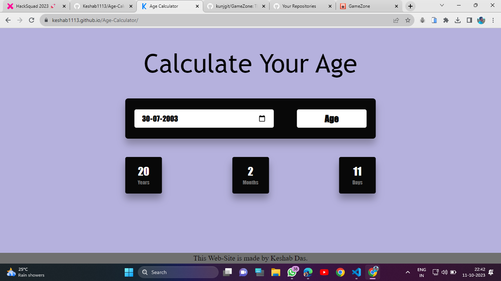

# **Game_Name** 

Age_Calculator

## **Description 📃**
Frontend game developed using HTML, CSS, JavaScript. Here user can see his/her age.

## **functionalities 🎮**
- Chose your date of birth.
- Click Age Button.
- And see your age.

## **How to play? 🕹️**
- Chose your date of birth.
- Click Age Button.

## **Screenshots 📸**

## **Working video 📹**

