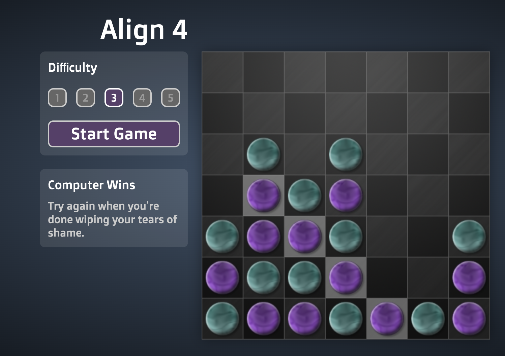

# **ALIEN_SHOOTERS**

---

 

## **Description 📃** 
- The logic of the game is basically there is computer and player so we are the player the main task of the player is to stop computer to align 4 balls horizontally or vertically or zigzagcally straight order.

## **functionalities 🎮** 
- Easy to play
- Scoring system so that you can compare points with computer.
- Responsive design for most of the monitors.
 

## **How to play? 🕹️**
- Start the game by clicking on start and then press the grid.
- Your aim is to stop the computer to making or aligning 4 balls in a line . 
 

## **Screenshots 📸**

 

 

