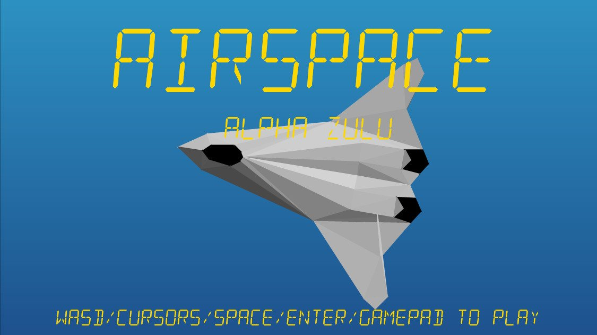

# **Alpha_Zulu** 

---

 

## **Description 📃**
- You are a test pilot in the navy and are out on operations testing an experimental new jet, callsign Alpha Zulu.

- Your task is to launch from the aircraft carrier, fly around and then safely land back on the carrier.

## **How to play? 🕹️**
- Controls:
	- Use cursor keys/WASD/gamepad to fly.
	- Q/E lateral adjustments. 
	- PageUp/PageDown to throttle. 
	- Speed is shown on the HUD on the left in knots, 
	- Altitude on the right in feet
	- Compass at the top.
	- Slow to about 60 knots, then make your landing approach. Good luck
	
 

## **Screenshots 📸**

 

 
