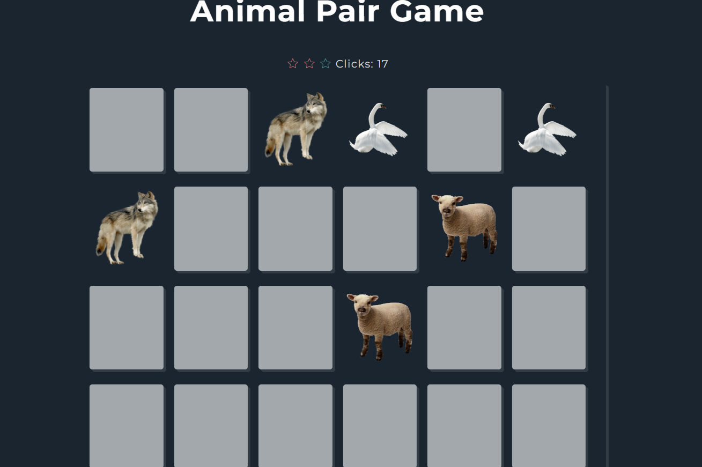

# **Animal_Pair**

---

 

## **Description 📃** 
- Create a memory matching game where players need to match pairs of animal cards. The game consists of a grid of facedown animal cards, and players need to flip over two cards at a time to find matching pairs. If the cards match, they remain face-up. If they don't match, they flip back over. The goal is to match all the animal pairs with the fewest number of moves.

## **functionalities 🎮** 
- Easy to play
- Responsive design for most of the monitors.
 

## **How to play? 🕹️**
- by clicking on the grid box you see animal image you need to pair the same animal by clicking on the next gird box
 

## **Screenshots 📸**

 

 

