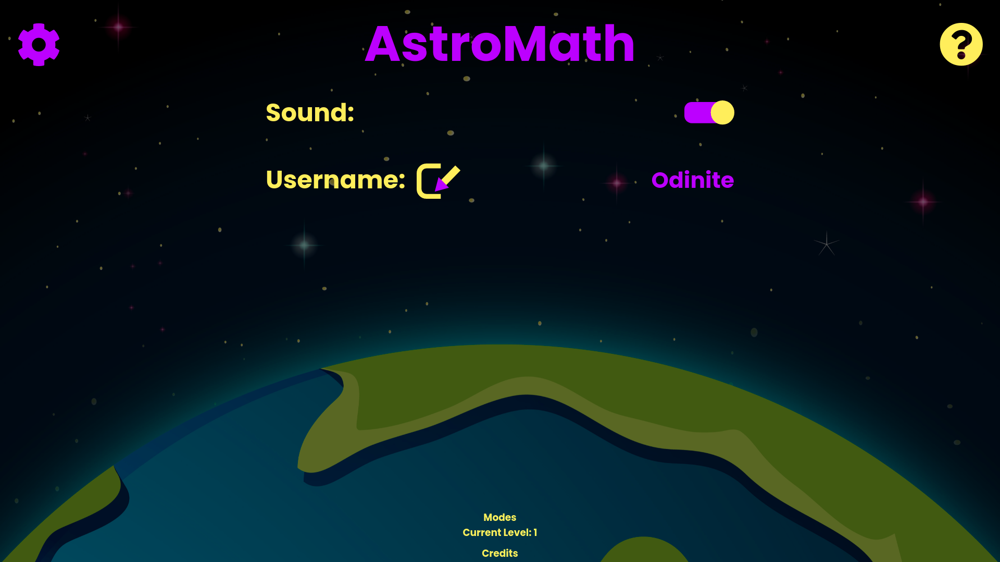
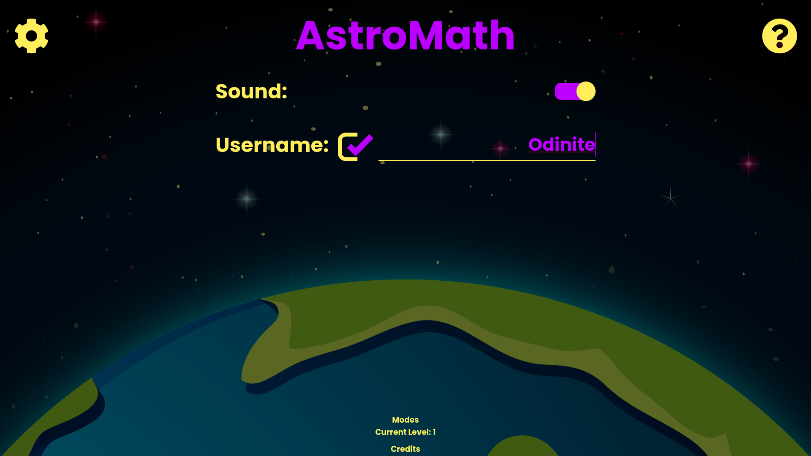
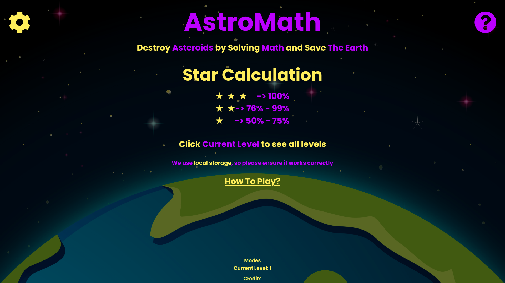
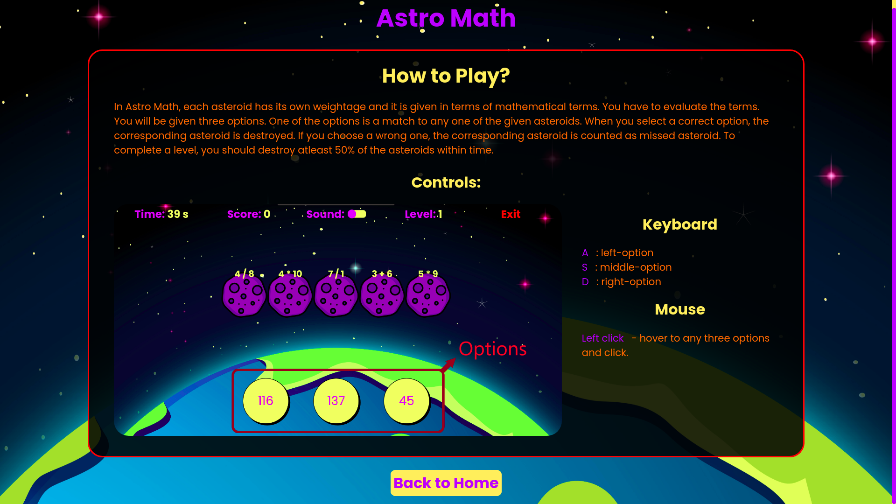
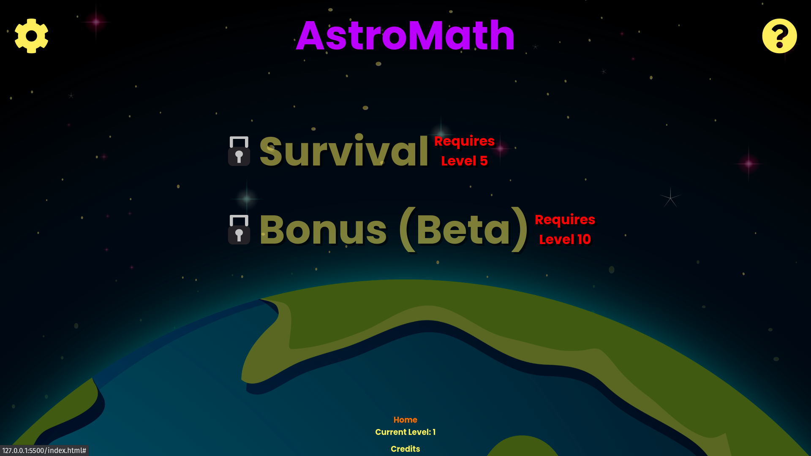
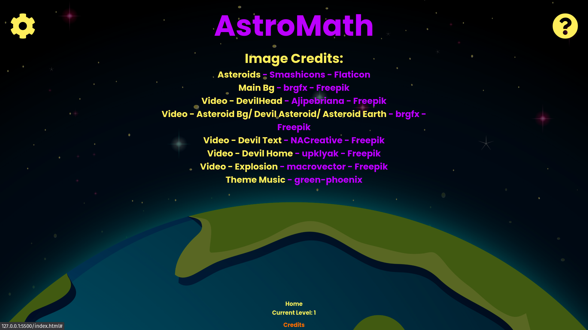
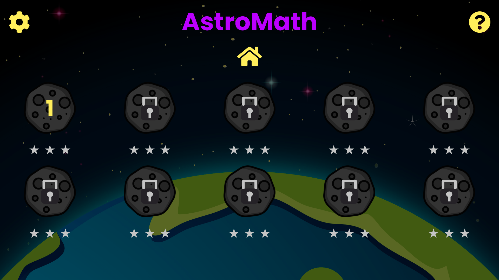

# AstroMath

## Languages & Tools
- HTML
- CSS
- JS

## Description:
  **Asteroids** will appear on the screen with problems on their head, user will be given with 3 options to choose at any point of time in the game. The user need to choose 1 option that will solve one of the asteroids problem. If the user choose the right option, that corresponding asteroid will be destroyed. The user need to destroy all asteroids to pass the level with three stars within the given time. 

## How To Play?
  **The User** needs to choose the answer that will match the problem of one of the asteroids in the screen.

  

## Demo
   
## Features
### Settings
   
#### Edit Name
   
#### Toggle Sound
   
### Info
   
#### HowTo?
   
### Modes
   
### Credits
   
### Levels
   
