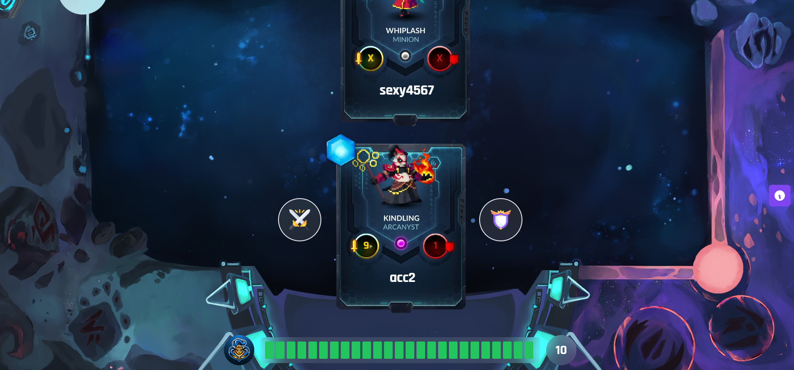

# **Avax Gods Card Game**

---

 

## **Description 📃** 
- This game is built to develop strategic thinking along with recreation.
- This project is built on a basic web tech stacks such as solidity, tailwind CSS and React Js.

## **functionalities 🎮** 
- A different card after each round.
-  Background sounds.
- Based on web3 technology.
 

## **How to play? 🕹️**
- The player simply needs to have a web3 wallet connected to avalanche-c testnet and then register himself on the homepage.
- The player then  gets to create or join a battle.
- All the battle rules can be seen by clicking on the purple info card on the right side when the battle has started.
- The player whose health becomes zero loses the battle.

 

## **Screenshots 📸**

 

 

