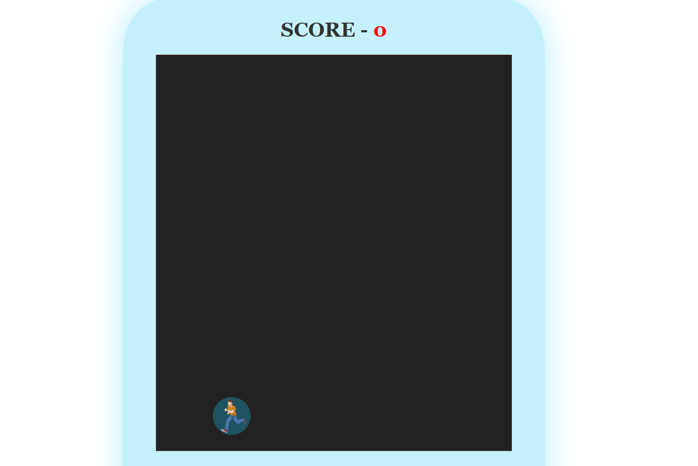

# **AVOIDER GAME** 

---

## **Description 📃**

- Avoider is a game, where you must avoid other attacking balls of different colors (red) in order to protect your own player ball(blue). You just have to manage to save your player ball (blue) by avoiding other balls...Try it out now!!!

## **functionalities 🎮**

- The speed of the game eventually increases after certain points, and you have to speed up your game to match that level.
- After successfully avoiding each attacking ball, you get one point.
- Points will get reflected on the scoreboard.

 

## **How to play? 🕹️**

- Press [<] or [>] to start the game.
-  Press Left [←] or Right [→] to move the player.
- You got a popup message with your score, at the end of each game.

 

## **Screenshots 📸**

 

## **Working video 📹**

https://github.com/kunjgit/GameZone/assets/114330097/4e089cca-e734-44bd-9bee-a3147547abc5

 
