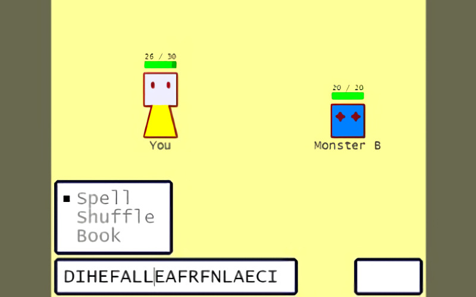

# **Backspace_Magic** 

---

 

## **Description 📃**
- Welcome to the world of magic world!
- You are in a trial. You must beat the boss to become officially a wizard.
- To cast a spell, you have to create it inside the "Spell Box".
- Inside the Spell Box, there are some random letters.
- You cannot type anything, the only thing you can rely on is ... BACKSPACE!

## **How to play? 🕹️**
- Instructions:
	- Spell Box content: XIXCXEAX
	- You remove the third and the fifth letter.
	- Spell Box content: XICEAX
	- See the word "ICE"? That is a spell. Press Enter to cast the spell.
	- Spell: To prepare to use a move
	- Shuffle: Shuffle the upcoming letters
	- Book: See available spells

- Controls:
	- Arrow Key: Move
	- Enter/Space: Choose, Cast spell
	- Backspace: Backspace!
		
 

## **Screenshots 📸**

 

 
