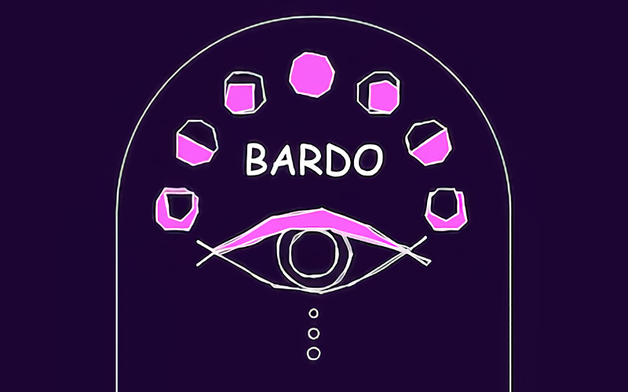

# **Bardo** 

---

 

## **Description 📃**
- In Buddhism, Bardo is the state of existence between two lives on Earth.

In this state, one may experience terrifying hallucinations that arise from previous actions.
- For prepared and appropriately trained individuals, Bardo offers a great opportunity for liberation.
While for others, it can be a place of great danger.

## **How to play? 🕹️**
- Instructions:
	- Rest from battle to regain your health and stamina. Health and stamina are represented onscreen by the red and blue bars, respectively.
	- Use your spartan charge and ground pound attacks to stun your enemies and gain the upper hand.
- Controls:
	- Movement - W, A, S, D (or) Arrows
	- Escape - Pause
	- Enter - Select
	- Pause - P

 

## **Screenshots 📸**

 

 
