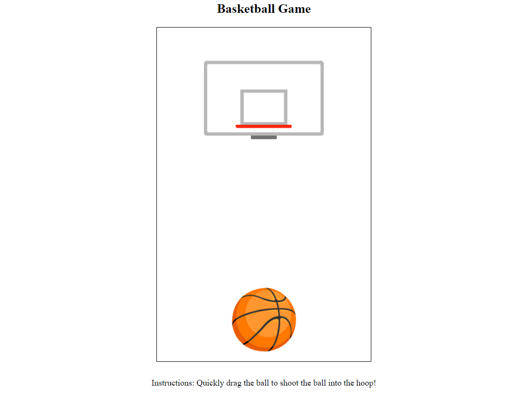

# **Game_Name** 
Basketball

 

## **Description 📃**
- It is a simple game made with HTML, bootstrap-css and JavaScript. It has a basket at a fixed position and a ball is given at various angles at various times. The player has to throw the ball into the basket and earn points.
 

## **functionalities 🎮**
- Everytime the player accurately throws the ball into the basket, he earns 1 point.
- A reaction is given through emojis for win or loss or consecutive wins or losses.
- Current best is shown.
 

## **How to play? 🕹️**
- It is simple, just drag the ball to shoot the ball into the basket.

 

## **Screenshots 📸**

 
