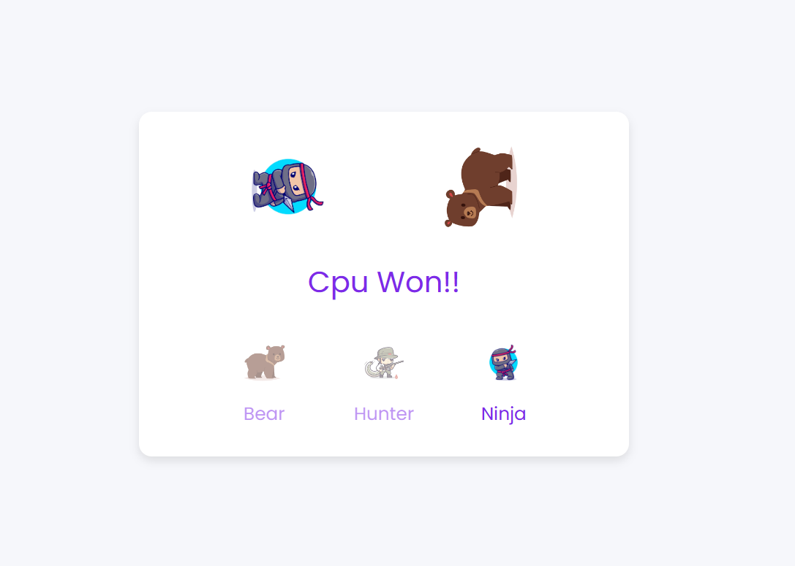

# **Bear_Hunter_Ninja** 

---

 

## **Description 📃**
<!-- add your game description here  -->
- The game is based on an fun alternate version of the classic game of rock paper and scissors consisting of three other similar elements bear, hunter and ninja! It is an entertaining game to play and enjoy :))

## **functionalities 🎮**
<!-- add functionalities over here -->
- In this game, the user is given three options to chose from as his desired move, user chooses one from the three options available and the computer does the same simultaneously(this is randomly generated) and thus, making the combinations, one of the both wins or either its a tie.
 

## **How to play? 🕹️**
<!-- add the steps how to play games -->
- In this,the user chooses one from the three options available and the computer does the same simultaneously. And thus, making the combinations such that either the user wins, computer wins or its a draw or tie.
In this game, players use the gestures of a bear, a hunter, and a ninja. The rules are as follows:
1. Bear beats hunter (bear mauls hunter).
2. Hunter beats ninja (hunter shoots ninja).
3. Ninja beats bear (ninja kills bear).

 

## **Screenshots 📸**

 
<!-- add your screenshots like this -->
<!--  -->

 

## **Working video 📹**
<!-- add your working video over here -->