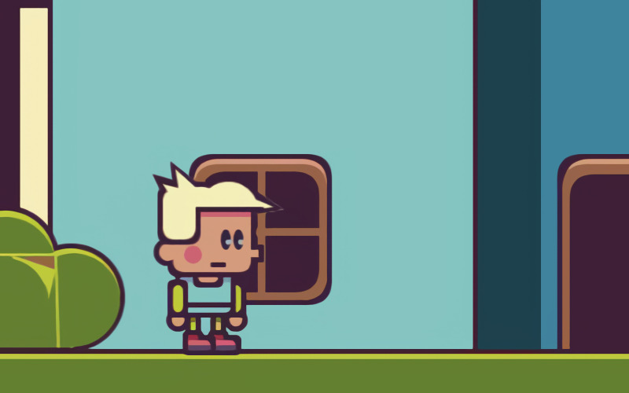

# **Behind_The_Scenary** 

---

 

## **Description 📃**
- Totally unfinished very buggy puzzle platformer.
- What goes on behind the scenery of a platformer?
- You can get behind the scenery, but there's not much to do there

## **How to play? 🕹️**
- Controls:
	- Arrow keys = move
	- Space = jump
	- Up = Enter door/jump over
	- z = throw/use item
	- x = select item
	- c = pickup item

m = mute musicn.
	
 

## **Screenshots 📸**

 

 
