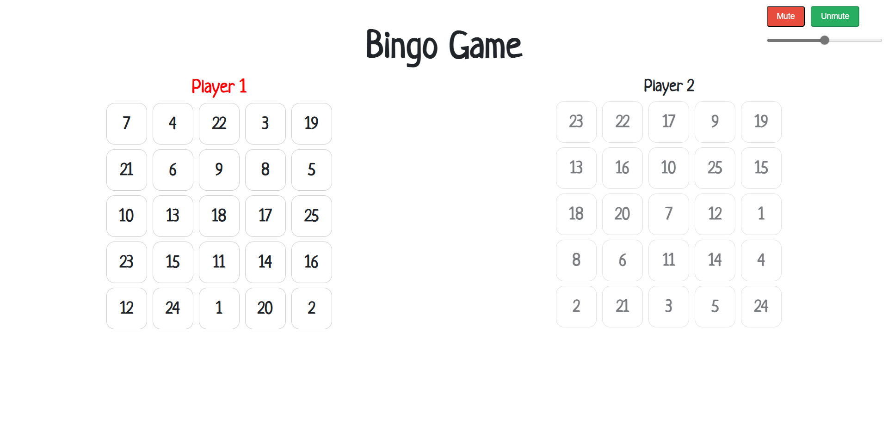

# **Bingo Game**

---

 

## **Description 📃** 
- This game is built to develop strategic thinking along with recreation.
- This project is built on a basic web tech stacks such as HTML, CSS and Javascript.

## **functionalities 🎮** 
- Shuffling of 25 numbers.
- Initializing scores at start of the game and score calculation after every "hit".
- Comparing and checking letters of "B I N G O" on each and every clicked.
- At the end of the game, declaring, either winner of the game or draw of the game.
- Also adding background sound in the background of the game, while playing.
- Providing support for the multi-players upto 10.
 

## **How to play? 🕹️**
- The game will start by asking number of players are playing this game.
- According to that boards are created and background song starts.
- On every click on the numbers, that number will not re-accessible for any player.
- On completion of all letters of "B I N G O", announcement will occur at the end.
- How final outcomes are decided?
    - Who first completed their "B I N G O" letters.

 

## **Screenshots 📸**

 

 

## **Working video 📹**
<!-- add your working video over here -->
https://drive.google.com/file/d/19UG8MYhlP15irIewnH1wmm76iOII8dEw/view?usp=sharing
