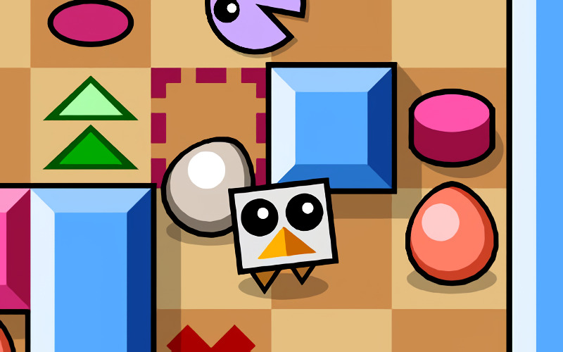

# **Birdlyeggs** 

---

 

## **Description 📃**
- Birdlyeggs is a puzzle game where you control a bird who want to get his/her eggs back. 
- The goal is to collect every egg in the stage and then return to the starting position.
- You may not stomp the eggs you have already collected, so try not to get stuck!
- The game includes 10+ stages and a password system to "store" your progress.

## **How to play? 🕹️**
- Controls:
	- Arrows keys: Move
	- R: Restart stage
	- F: Toggle fullscreen
	- Enter: accept things in menus, or open the pause menu
	
 

## **Screenshots 📸**

 

 
