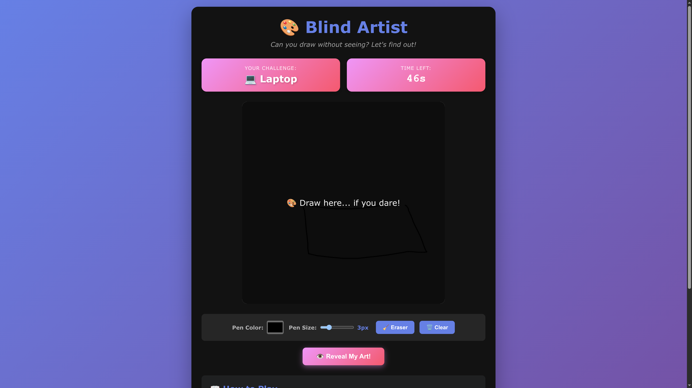

# 🎨 Blind Artist

## Game Description

**Blind Artist** is a unique and hilarious drawing game where you attempt to draw simple objects on a completely hidden canvas! The twist? You can't see what you're drawing until you reveal it at the end. Test your spatial memory, visualization skills, and have a good laugh at the results!

## 🎮 How to Play

1. Click **"Start Drawing"** to receive a random drawing prompt
2. Draw the object on the invisible canvas (you can't see your strokes!)
3. You have **60 seconds** to complete your masterpiece
4. Click **"Reveal My Art!"** when done or wait for time to run out
5. See your hilarious creation and rate your artwork!
6. Try again or get a new challenge

## 🎯 Game Features

### Core Features
- ✨ **Invisible Canvas**: Draw without seeing - the ultimate challenge!
- ⏰ **60-Second Timer**: Race against time to complete your drawing
- 🎲 **30+ Random Prompts**: From simple objects to complex creatures
- 🎨 **Drawing Tools**: Color picker, adjustable pen size, eraser
- ⭐ **Self-Rating System**: Rate your artwork from 1-5 stars
- 💾 **Download Option**: Save your masterpiece as PNG
- 📱 **Fully Responsive**: Works on desktop, tablet, and mobile

### Available Prompts
House, Cat, Dog, Tree, Sun, Moon, Star, Car, Airplane, Bicycle, Apple, Pizza, Cake, Flower, Butterfly, Fish, Elephant, Giraffe, Balloon, Ball, Crown, Guitar, Palette, Phone, Laptop, Mountain, Wave, Boat, Castle, and more!

## 🕹️ Controls

### Desktop
- **Mouse**: Click and drag to draw
- **Color Picker**: Choose your pen color
- **Pen Size Slider**: Adjust stroke thickness (1-10px)
- **Eraser Button**: Toggle between pen and eraser mode
- **Clear Button**: Erase entire canvas

### Mobile
- **Touch**: Tap and drag to draw
- All other controls work the same as desktop

## 🎨 Drawing Tips

1. **Visualize First**: Picture the object in your mind before starting
2. **Start with Basic Shapes**: Begin with simple outlines
3. **Use Reference Points**: Remember where you started
4. **Don't Overthink**: Sometimes the funniest results come from mistakes!
5. **Try Multiple Times**: Each attempt improves your spatial memory

## 🛠️ Technologies Used

- **HTML5 Canvas**: For drawing functionality
- **Vanilla JavaScript**: Game logic and interactivity
- **CSS3**: Modern styling and animations
- **Responsive Design**: Mobile-first approach

## 📸 Screenshots

### Main Game Screen


*Note: Add your screenshot here after playing the game!*

## 🎯 Why This Game is Unique

1. **Not Just Another Drawing Game**: The invisible canvas mechanic is what makes it special
2. **Comedy Gold**: Results are often hilariously bad (in a good way!)
3. **Shareable**: Perfect for social media - everyone loves sharing their funny drawings
4. **Educational**: Improves spatial awareness and mental visualization
5. **No Artistic Skills Required**: Everyone can play and have fun!

## 🚀 Future Enhancements

Potential features for future versions:
- [ ] Difficulty levels (easy, medium, hard objects)
- [ ] Multiplayer mode (compare drawings with friends)
- [ ] Daily challenge with global leaderboard
- [ ] Animation replay (watch your drawing appear stroke-by-stroke)
- [ ] More drawing tools (shapes, stamps)
- [ ] Achievement system
- [ ] Social sharing integration
- [ ] Custom prompt creator

## 💻 Installation & Setup

1. Clone the GameZone repository
2. Navigate to `Games/Blind_Artist/`
3. Open `index.html` in your web browser
4. Start drawing and have fun!

No build process or dependencies required - just open and play!

## 🤝 Contributing

This game is part of the [GameZone](https://github.com/kunjgit/GameZone) open source project. Contributions, suggestions, and improvements are always welcome!

### Ways to Contribute
- Report bugs or issues
- Suggest new features
- Add more drawing prompts
- Improve UI/UX design
- Optimize performance

## 📝 Code Structure

```
Blind_Artist/
├── index.html      # Main HTML structure
├── style.css       # Styling and animations
├── script.js       # Game logic and canvas handling
└── README.md       # This file
```

### Key Functions in script.js
- `startGame()`: Initializes new game session
- `startDrawing()`, `draw()`, `stopDrawing()`: Canvas drawing mechanics
- `revealDrawing()`: Shows the hidden canvas
- `downloadDrawing()`: Saves canvas as image
- `getRandomPrompt()`: Selects random object to draw

## 🎓 Learning Outcomes

Building this game taught me:
- HTML5 Canvas API manipulation
- Mouse and touch event handling
- Timer and state management in JavaScript
- Responsive design best practices
- Game flow and UX design
- Cross-browser compatibility

## 🐛 Known Issues

None currently! If you find any bugs, please report them.

## 📄 License

This project is part of GameZone and follows the Apache-2.0 License.

## 👨‍💻 Author

Created with ❤️ as my first open source contribution to GameZone!

## 🎉 Acknowledgments

- Thanks to the GameZone community for the opportunity
- Inspired by spatial memory games and blind contour drawing exercises
- Special thanks to all testers who laughed at their drawings!

---

## 🎮 Play Now!

Ready to test your blind drawing skills? Click that Start button and let's see what masterpiece you create!

**Remember**: The best drawings come from not seeing! 😄

---

*Made for [GameZone](https://github.com/kunjgit/GameZone) - A collection of awesome web games!*