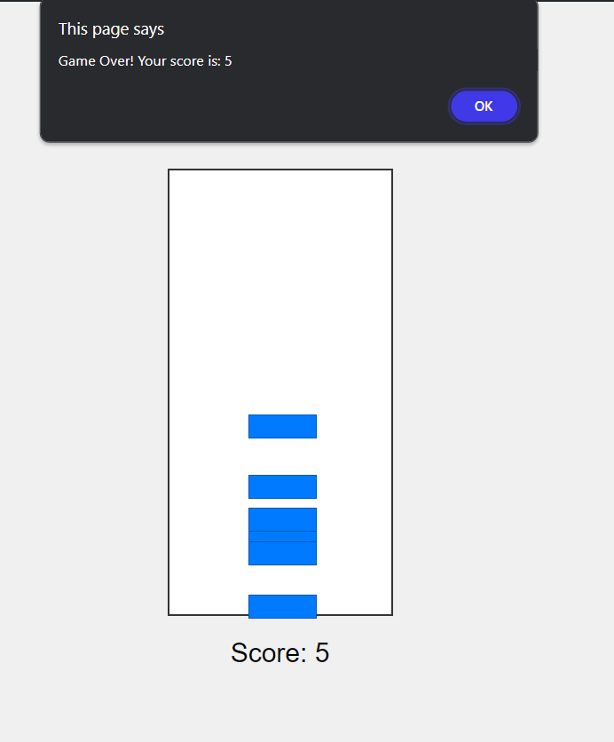

# ** Block Building ** 

 

## **Description 📃**

This is a simple Block Builder game built using HTML, CSS, and JavaScript. The objective of the game is to build a tower as high as possible by stacking blocks on top of each other. The player earns points for each successful block placement.

## **functionalities 🎮**

- Simple and intuitive gameplay.

- Responsive design suitable for various screen sizes.

- Score display to track the player's progress.

- Game over alert with final score.

 

## **How to play? 🕹️**

- Click anywhere on the game area to drop a block.

- Stack blocks on top of each other to build a tower.

- Earn points for each successful block placement.

- Be careful not to miss the tower, as dropping a block off the tower ends the game.

 

## **Screenshots 📸**

 

