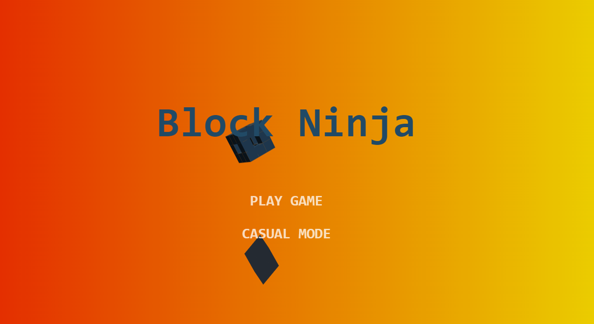

# **Block Ninja**

---

## **Description 📃**
Block Ninja is an engaging and addictive game where players must slash through blocks that appear on the screen while avoiding dangerous obstacles. The game tests your reflexes and precision as you aim to score the highest points by slicing through as many blocks as possible. The challenge increases with each level, making it an exciting experience for players of all ages.

## **Functionalities 🎮**
- **Start Game:** Begin a new game session.
- **Slash Blocks:** Use swipe gestures or mouse movements to slash through blocks.
- **Avoid Obstacles:** Dodge dangerous obstacles to prevent losing points or ending the game.
- **Score Tracking:** Keep track of your highest scores and aim to beat them.
- **Multiple Levels:** Progress through various levels of increasing difficulty.
- **Sound Effects:** Enjoy immersive sound effects that enhance the gaming experience.
- **Pause/Resume:** Pause the game anytime and resume from where you left off.

## **How to Play? 🕹️**
1. **Launch the Game:**
   - Open the Block Ninja game application on your device.
   
2. **Start a New Game:**
   - Click on the "Start Game" button to begin.

3. **Slash Blocks:**
   - Use your finger (on touch screens) or mouse (on computers) to swipe across the screen.
   - Slash through the blocks that appear to score points.
   
4. **Avoid Obstacles:**
   - Be cautious of obstacles that appear among the blocks.
   - Avoid slashing through these obstacles as they can end the game or reduce your points.

5. **Score Points:**
   - Successfully slashing blocks will earn you points.
   - Try to slash multiple blocks in one swipe for combo points.

6. **Advance Through Levels:**
   - As you score points, you'll advance through levels of increasing difficulty.
   - Each level presents new challenges and faster-moving blocks.

7. **Pause/Resume:**
   - You can pause the game at any time by clicking the "Pause" button.
   - Resume the game from the same point by clicking "Resume."

8. **End of Game:**
   - The game ends when you hit a dangerous obstacle or miss too many blocks.
   - Your final score will be displayed, and you can choose to start a new game.

---

Enjoy slicing through blocks and mastering the art of the Block Ninja! Can you achieve the highest score and become the ultimate ninja?

## **Screenshots 📸**

 

