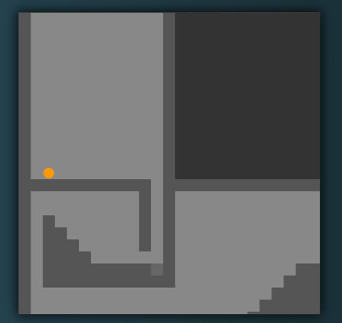

# Clarity

A simple, customisable and scriptable platform game engine.

See it in action here: http://codepen.io/suffick/pen/CqIxk
 
image of the game:
 

 
All map data is contained within the "map" variable in index.html, you can add new maps by making different map variables and loading them via an activated script as demonstrated. You can activate any script you want when a certain tile is entered, there are countless possibilites such as colour activated gates, teleportation, loading new maps, activating traps, and killing the player. It's limited to your imagination, so get creative.

Have a look at the comments in the map variable to understand how it works.
