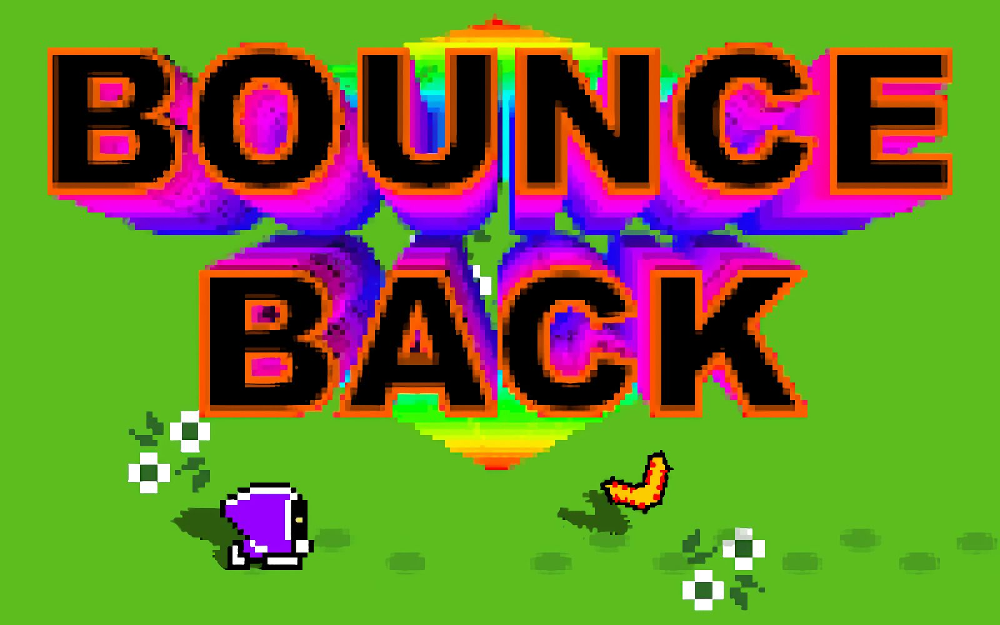

# **Bounceback** 

---

 

## **Description 📃**
- When life gets you down, it's never too late to bounceback
- A Boomerang Roguelite Game with well structured levels

## **How to play? 🕹️**
- Controls:
	* WASD = Move
	* Mouse = Aim
	* Click = Throw
	* Space = Dash

- Hints:
	* Boosting protects you from damage.
	* Buy items to help you survive.
	* You don't lose money when you die!
	* There are only 10 levels.
	* Lost boomerangs show up big on the map.
	* Enemies are slowed by sand.
	* Yellow boormang can grab pickups.
	* Blue boomerang does double damage.
	* Win to unlock speed run mode.
  
- Game Features:
	* Boomerang physics & boost ability
	* Procedural level generation
	* 3 Enemy types
	* 7 types of pickups
	* Giant and invisible enemy variants
	* Final boss battle
	* Saves gems earned and max level reached
	* Shop system for buying items
	* Minimap
	* Footsteps, blood, and persistant effects system
	* 16 Different sound effects with zzfx
	* Procedurally generated music
	* Speed run mode doesn't effect normal save
	* Low health warning system
	* Level transition effect
	
 

## **Screenshots 📸**

 

 
