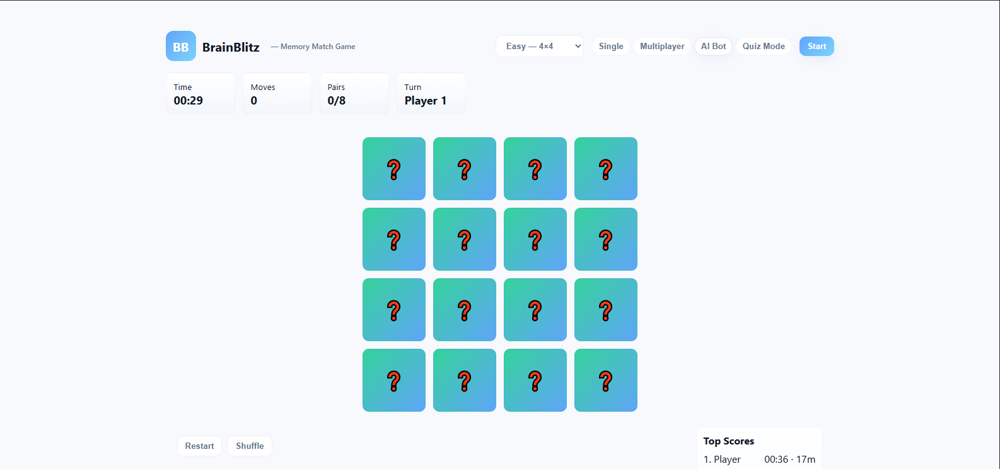

# BrainBlitz - Memory Card Game 🧠

BrainBlitz is an engaging and interactive memory card game with multiple game modes, designed to challenge your memory while having fun. Built with vanilla JavaScript, HTML5, and CSS3, this game offers a polished user interface with smooth animations and responsive design.

## 🎮 Features

### Multiple Game Modes
- **Single Player**: Classic memory matching gameplay
- **Multiplayer**: Compete with a friend in turn-based matches
- **AI Bot**: Challenge an intelligent bot that learns from gameplay
- **Quiz Mode**: Test your knowledge while matching cards

### Difficulty Levels
- **Easy**: 4×4 grid (8 pairs)
- **Medium**: 6×6 grid (18 pairs)
- **Hard**: 8×8 grid (32 pairs)

### Game Features
- 🕒 Real-time game timer
- 📊 Move counter
- 🏆 Leaderboard system
- 🔄 Card shuffling
- 💡 Smart AI opponent
- ❓ Educational quiz system
- 📱 Responsive design

## 🎯 How to Play

1. **Select Game Mode**
   - Choose between Single Player, Multiplayer, AI Bot, or Quiz Mode
   - Select your preferred difficulty level

2. **Game Rules**
   - Click cards to reveal their emojis
   - Match pairs of identical emojis
   - In Quiz Mode, correctly answer questions to secure matches
   - Complete the game with minimum moves and time

3. **Scoring System**
   - Track your moves
   - Monitor time taken
   - Compare with other players on the leaderboard

## 🎲 Game Modes in Detail

### Single Player
- Classic memory matching gameplay
- Focus on achieving best time and minimum moves

### Multiplayer
- Turn-based gameplay for two players
- Players keep matched pairs as points
- Continue turn after successful matches

### AI Bot
- Challenge an adaptive AI opponent
- AI learns from discovered cards
- Strategic gameplay with mistake probability

### Quiz Mode
- Match cards and answer questions
- Correct answers secure the match
- Wrong answers shuffle unmatched cards
- Educational and entertaining

## 🎛️ Controls

- Click cards to flip them
- Use 'R' key for quick restart
- Click 'Shuffle' to rearrange unmatched cards
- Click 'Restart' to begin a new game

## 📊 Screenshots

## 💡 Tips

- In Quiz Mode, focus on both memory and knowledge
- Study the board carefully before making moves
- Use the shuffle feature strategically
- Practice with easier difficulties before challenging harder levels

## 🛠️ Technical Details

- Built with vanilla JavaScript
- No external dependencies
- Responsive CSS Grid layout
- Local Storage for score persistence
- Smooth CSS transitions and animations

## 🚀 Quick Start

1. Open `index.html` in a modern web browser
2. Select your preferred game mode
3. Choose difficulty level
4. Click 'Start' to begin playing

## 🔄 Future Updates

- Additional game modes
- More quiz questions
- Online multiplayer support
- Theme customization
- Sound effects and background music

---

Enjoy playing BrainBlitz! Challenge yourself, compete with friends, and improve your memory while having fun! 🎮✨