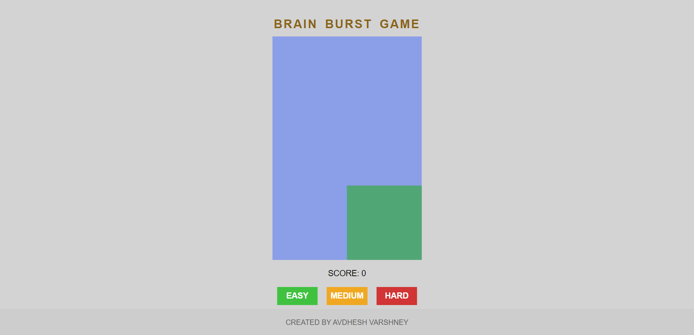

# **BRAIN BURST GAME** 

---

 

## **Description 📃** 
- This project is built on a basic web tech stacks such as HTML, CSS and Javascript.
- This is a single-player game.

 

## **Functionalities 🎮** 
- Select the difficulty level according to your convenience.
- Click on the boxes that are formed randomly.
- If player is able to click before go away from the position, score will increases.
- Otherwise, score remains same.

 

## ** Additional Features **
- Implementing a graphical user interface (GUI) for a more interactive experience.

 

## **Screenshots 📸**

 

 

## **Working video 📹**
https://github.com/kunjgit/GameZone/assets/114330097/115588cb-c53b-4663-8d68-2d1b5a3ed205

 

## **Creator 👦**
[Avdhesh Varshney](https://github.com/Avdhesh-Varshney)

 
