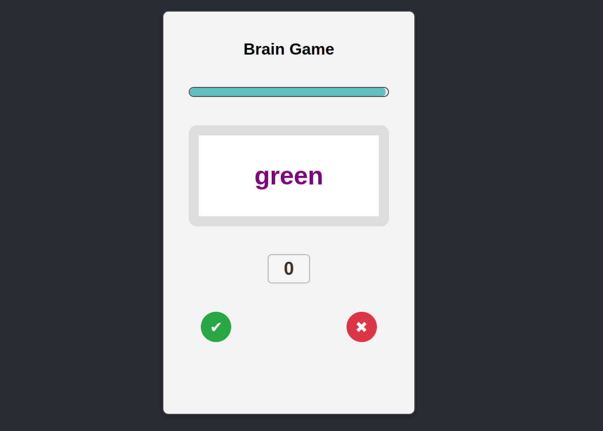

# **Brain Game** 

---

 

## **Description 📃**
<!-- add your game description here  -->
- **Brain Game** is an interactive game where the player needs to determine if the name of the color matches its displayed color.
- This is a single-player game.

## **functionalities 🎮**
<!-- add functionalities over here -->
- The name of the color is display on the screen,the player checks whether the name of the color matches its displayed color.
- The player have to decide within the time if it matches or not and click on the right option.
- It provide the Keyboard Support where players can use the left arrow key (←) for "tick" and the right arrow key (→) for "cross" option.
 

## **How to play? 🕹️**
<!-- add the steps how to play games -->
- Click on the start button to start the game.
- Checks whether the name of the color matches its displayed color.
- If yes click on "tick" or use left arrow key (←) else click on "cross" or use right arrow key (→).
- If click on wrong option the game ends with the score alert.

 

## **Screenshots 📸**

 

 

<!-- ## **Working video 📹** -->
<!-- add your working video over here -->
