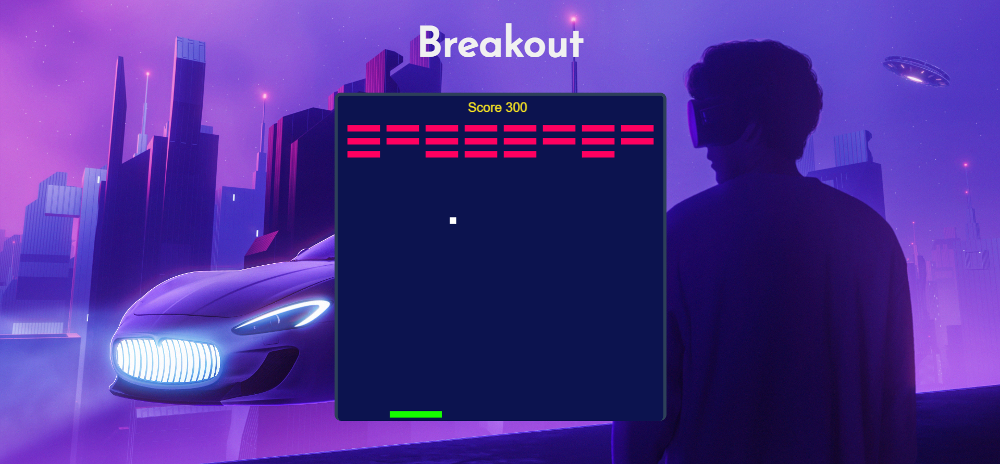

# **Breakout** 

---

 

## **Description 📃**
The objective of the game is to use the paddle to bounce the ball towards the bricks and destroy them. You win when all the bricks are destroyed. But if the ball falls below the paddle into the fiery pits of doom, you lose the game. The paddle has "zones" which bounce the ball in different angles. Try out the game and you will notice it. If the ball bounces at the center, it goes straight up. As it goes to the sides, it's angle and speed increase. This gives you a certain degree of control over the direction of the ball.

## **functionalities 🎮**
- Left Arrow: Move paddle left. 
- Right Arrow: Move paddle right.
 

## **How to play? 🕹️**
- The game will start with ball at the center.
- Your role is to use the paddle at the bottom and hit the ball, so that the ball hits and smashed the bricks on the top.
- Try not to let the ball touch the ground; if happens so, then will you lose the game.
- If all the bricks are smashed then you Win!

 

## **Screenshots 📸**

 

 

## **Working video 📹**
<!-- add your working video over here -->
