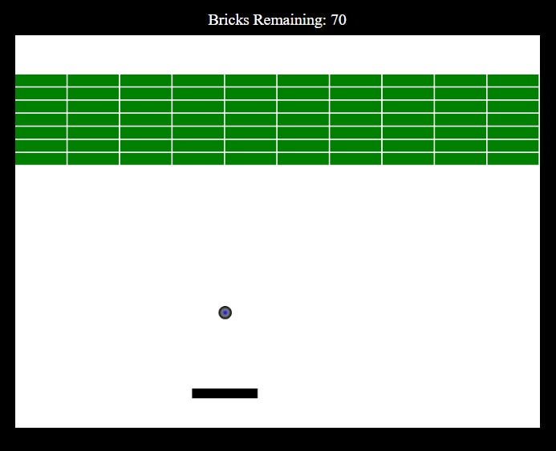

# **Brick_Breaker** 

---

 

## **Description 📃**
- This is a classic Brick Breaking Game made using HTML & CSS only that we all know and love!

## **functionalities 🎮**
- Features of a classic Brick Breaking Game
- Shows Remaining number of bricks on the top
 

## **How to play? 🕹️**
- Simply moving the mouse moves the paddle with which u can bounce the ball and destroy the bricks.

 

## **Scores:**
- +1 for each brick broken till number of bricks is greater than or equal to 60.
- +2 for each brick broken till number of bricks is less than 60 and greater than or equal to 50.
- +5 for each brick broken if number of bricks is less than 50;
## **Screenshots 📸**

 
<!-- add your screenshots like this -->

  
 

## **Working video 📹**
<!-- add your working video over here -->
