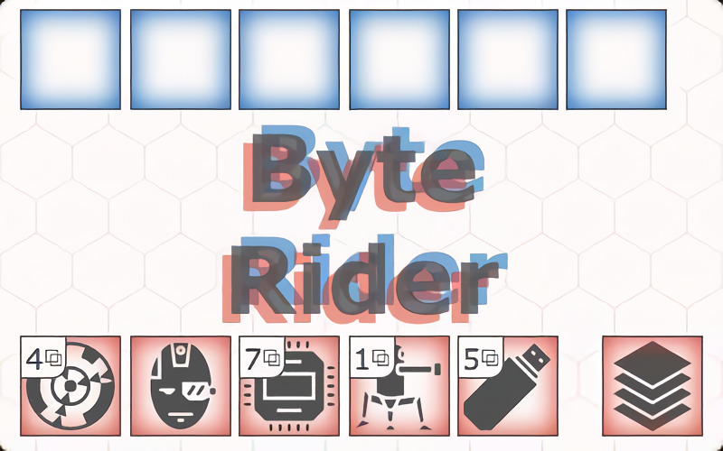

# **Byte_Rider** 

---

 

## **Description 📃**
- Byte Rider is a two player card game, you against an AI.
- On your turn you may take one action then it's the AI's turn. The first to reach 21 points wins.

## **How to play? 🕹️**
- Draw a card and add it to your hand.
- Play a point card and score its value.
- Discard a point card to trigger an effect.
- Play a non-point card to trigger a permanent effect.
- Play a point card on an equal or lower value point card. Discard both cards.
	
 

## **Screenshots 📸**

 

 
