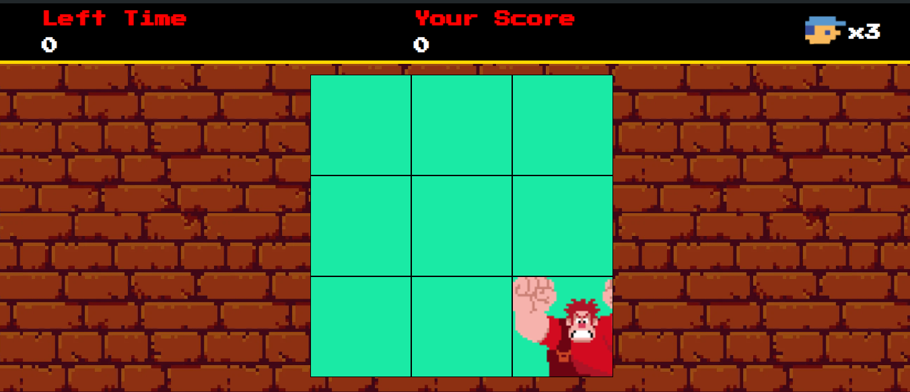

## Catch him 
"Catch Him" is a fun and engaging game that involves quick reflexes and strategic thinking. The main objective of the game is to catch a character named Ralph, who moves swiftly across the screen. Players must click or tap on Ralph as he appears in different locations, often disappearing and reappearing quickly to increase the challenge. The game typically includes various levels of difficulty, with Ralph moving faster and more unpredictably as players advance. It's a great game for testing hand-eye coordination and speed, providing an entertaining and competitive experience for players of all ages.

## How to play ?:

1. **Objective**: Your goal is to catch Ralph by clicking or tapping on him whenever he appears on the screen.

2. **Gameplay**:
   - Ralph will move around the screen and may disappear and reappear in different locations.
   - Use your mouse (if on a computer)  tap to catch Ralph.
   - Each time you successfully catch Ralph, you earn points.

3. **Time Limit**: The game may have a time limit . Try to catch Ralph as many times as possible before time runs out.

4. **Score**: Your score is based on how many times you catch Ralph. Aim for a high score and challenge yourself to improve with each playthrough.

## Screenshot
