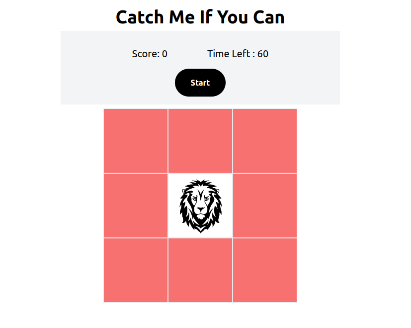

# **Catch Me If You Can**

---

 

## **Description 📃**

- Catch Me If You Can is a fun and engaging mouse-clicking game with a time limit of 1 minute. The objective of the game is to locate and click on the box that contains the lion logo as quickly as possible. Each successful click earns the player 1 point. The lion logo is randomly moved to another box within the grid after each successful click. The game continues for 1 minute, and the player aims to score as high as possible by clicking on the lion logo in each new location.

## **Key Features 🔑 📃**

1. Random placement of the lion logo: The lion logo is initially placed randomly in one of the boxes, ensuring each game session starts with a different configuration.
2. Time limit: The game is time-based, adding a sense of urgency and encouraging players to act swiftly.
3. Scoring system: Each successful click on the correct box earns the player 1 point, allowing for a competitive element and encouraging players to achieve high scores.
4. Dynamic movement: After every successful click, the lion logo is relocated to another random box, keeping the gameplay unpredictable and engaging.
5. Visual feedback: The game can provide visual feedback, such as highlighting the correct box or displaying a score counter, to enhance the player's experience and understanding of their progress.

## **Functionalities 🎮**

1. Start the game by clicking the "Start" button.
2. Click on the box that contains the lion logo to score points.
3. The lion logo will be randomly moved to another box after each successful click.
4. The game ends after 1 minute, and the player's score is displayed.
5. Pause and resume the game using the "Pause" button.
    

## **How to play? 🕹️**

1. Click the "Start" button to begin the game.
2. Locate the box that contains the lion logo.
3. Click on the correct box to score points.
4. After each successful click, the lion logo will move to another random box.
5. Continue to locate and click on the lion logo within the time limit of 1 minute.
6. The game ends after 1 minute, and your score will be displayed.
7. Try to achieve the highest score by clicking on the lion logo as accurately and quickly as possible.

 

## **Screenshots 📸**

 

 
