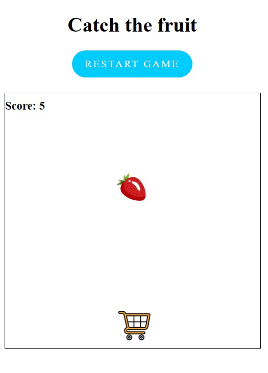

# **Game_Name** 

---

 

## **Description 📃**
<!-- add your game description here  -->
"Catch the Fruit" is an exciting and fast-paced game where your reflexes and hand-eye coordination will be put to the test. Your mission is to control the player character and catch falling fruits as they descend from the top of the screen.

As the game begins, you'll find yourself in a vibrant and colorful game world. The player character, represented by a nimble blue square, is controlled by your mouse movements. Move the mouse horizontally within the game container to position the player and aim for the falling fruits.

Keep a close eye on the screen as a variety of juicy and tempting fruits start falling from above. The fruits, depicted as delightful red circles, will descend at varying speeds, adding to the challenge. Your task is to maneuver the player skillfully, aligning it with the falling fruits to make successful catches.
- 

## **functionalities 🎮**
<!-- add functionalities over here -->
- The game is a simple catch-the-falling-fruit game where the player controls a character to catch falling fruits.
- The player can move horizontally within the game container using the mouse.
- Fruits fall from the top of the game container and the player needs to position themselves to catch the falling fruits.
- When a fruit is caught, the player's score increases.
- If a fruit reaches the bottom without being caught, it resets to the top, and the game continues.
- The game continues indefinitely, allowing the player to try to achieve the highest score possible.
- 
 

## **How to play? 🕹️**
<!-- add the steps how to play games -->
- Use your mouse to control the player character. Move the mouse horizontally to position the player within the game container.
- As the game begins, fruits will start falling from the top of the screen.
- Your goal is to catch the falling fruits with the trolley.
- Position the trolley directly under a falling fruit to make a successful catch.
- Each time you catch a fruit, your score will increase by one point.
- Be quick and precise with your movements to catch as many fruits as possible.

 

## **Screenshots 📸**

 
<!-- add your screenshots like this -->
<!--  -->

 

<!-- ## **Working video 📹** -->
<!-- add your working video over here -->