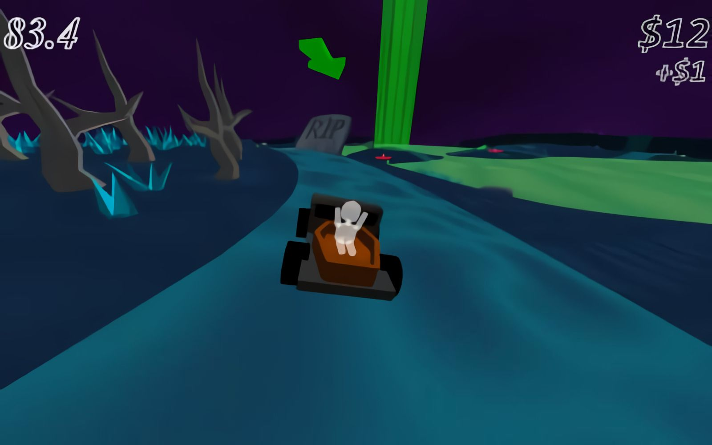

# **Charon_Jr** 

---

 

## **Description 📃**
- After centuries of faithful service, Charon, also known as the ferryman of the dead, has retired. 
- His son is now collecting payments from the dead and escorting them to the next life. Just with one small change.
- Pick up a spirit by stopping next to it. Follow the arrow to their portal to the afterlife. 
- Stop in the portal to let them pass over. Hit jumps to collect larger payments.

## **How to play? 🕹️**
- Controller Recommended, but keyboard also works:
- Accelerate: Right Trigger or `W`
- Brake: Left Trigger Or `S`
- Steer: Analog stick, d-pad, or `A`/`D`
- Menu Choose: `A`/`D`, d-pad, or analog stick.
- Menu Confirm: `A` button, Start, or `Enter`

 

## **Screenshots 📸**

 

 
