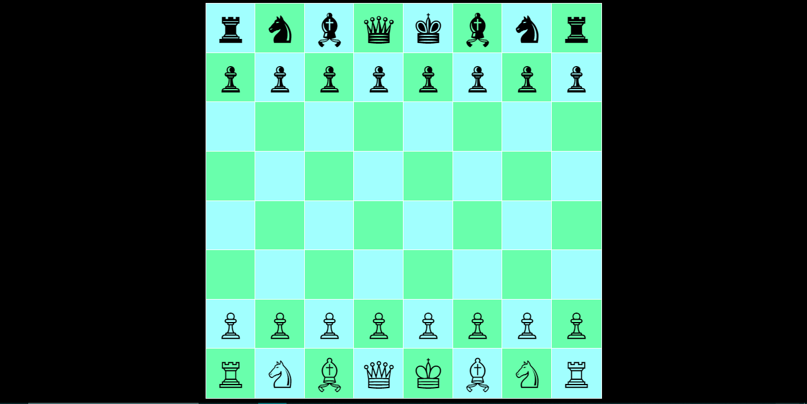

# 🎮 AI Chess Game Request

## **Description 📃**
We propose the development of an AI-powered chess game that offers an engaging and challenging experience to players of all levels. The game will leverage advanced algorithms to provide intelligent gameplay while also offering a user-friendly interface for an immersive gaming experience.

## **functionalities 🎮**
- **Intelligent AI Opponent**: The game will feature an AI opponent with varying levels of difficulty, from beginner to grandmaster, to provide a challenging experience for players of all skill levels.

## **How to play? 🕹️**
- Players can make moves by dragging and dropping chess pieces to desired locations on the board.
- The game will follow standard chess rules, including move validation and checkmate detection.
- Players can select the difficulty level of the AI opponent to match their skill level.

 

## **Screenshots 📸**

 

 

