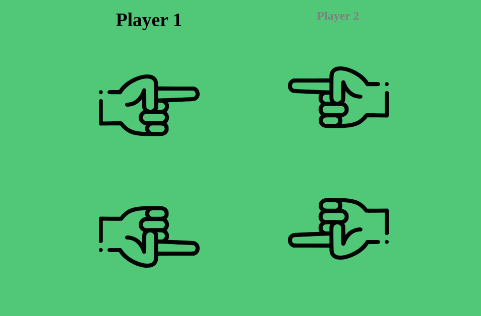
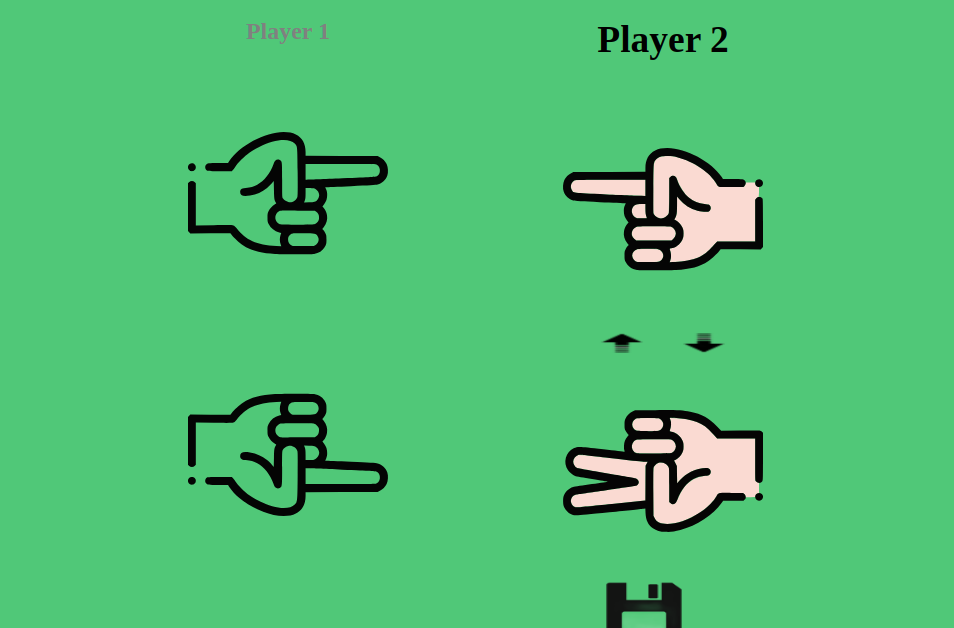
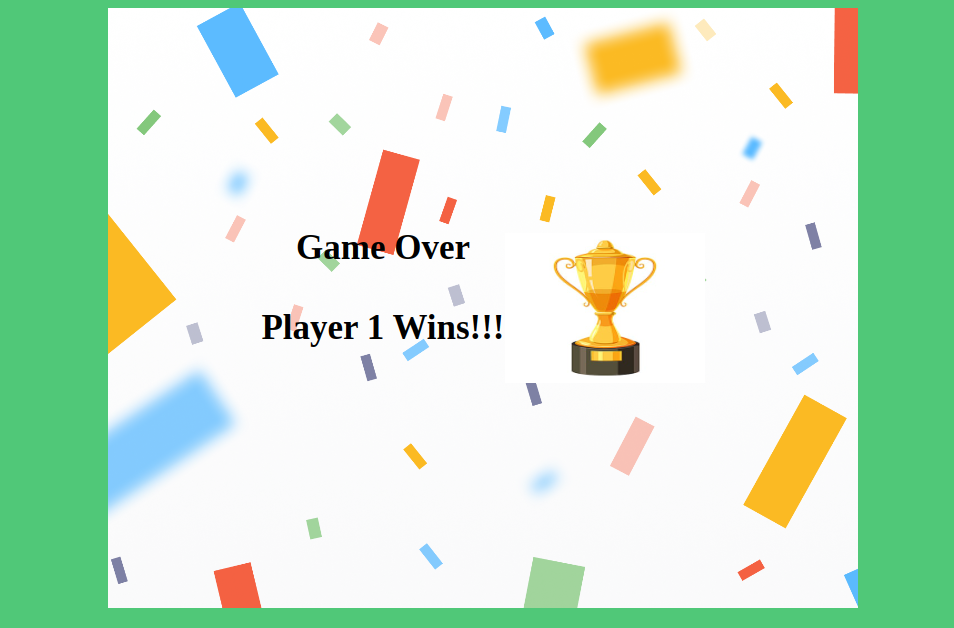

# **CHOPSTICKS**

---

 

## **Description 📃** 
Chopsticks is a hand game for two or more players 

## **How to play? 🕹️**
Each player has one point on each hand and in each turn a player can attack or split. For attack: a player can add their points to another player's hand. For split: a player can redistribute their points among both hands. Press on the up and the down arrow to redistribute points and press on 'Save'. If the number of points on one hand reaches five or greater than five, the player loses a hand. The player loses the game if both hands are lost.

 

## **Screenshots 📸**

 
 
 

 

**Working video 📹**
<!-- add your working video over here -->
https://drive.google.com/file/d/1O6t2CbxZBiRHNDgE5K60IlJTYrlhysDC/view?usp=drive_link
<figure class="video_container">
  <video controls="true" allowfullscreen="true" poster="path/to/poster_image.png">
    <source src="video.webm">
  </video>
</figure>

## Note
Attribution: <a href="https://www.flaticon.com/free-icons/two" title="two icons">Two icons created by Freepik - Flaticon</a>
