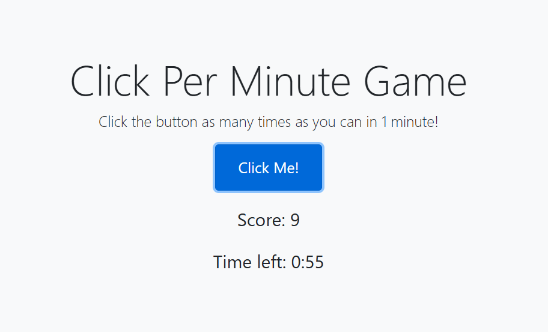

# **Click Per Minute** 

---

 

## **Description 📃**

- The "Click Per Minute Game" is an exciting and engaging game where users aim to achieve the highest number of clicks within one minute. It’s a fun and competitive way to test and improve your clicking speed and reaction time.

## **functionalities 🎮**
  
- Real-Time Point Counting: Keep track of your score in real-time as you click the button.
Timer: A one-minute countdown timer to challenge your speed.
Clicking Speed Display: See how fast you can click within the given time frame.

 

## **How to play? 🕹️**
Simply click the "Click Me!" button as many times as you can within one minute.
Your score will be updated in real-time.
Once the timer reaches zero, your final score will be displayed, showing the total number of clicks per minute.
- 

 

## **Screenshots 📸**

 

 

