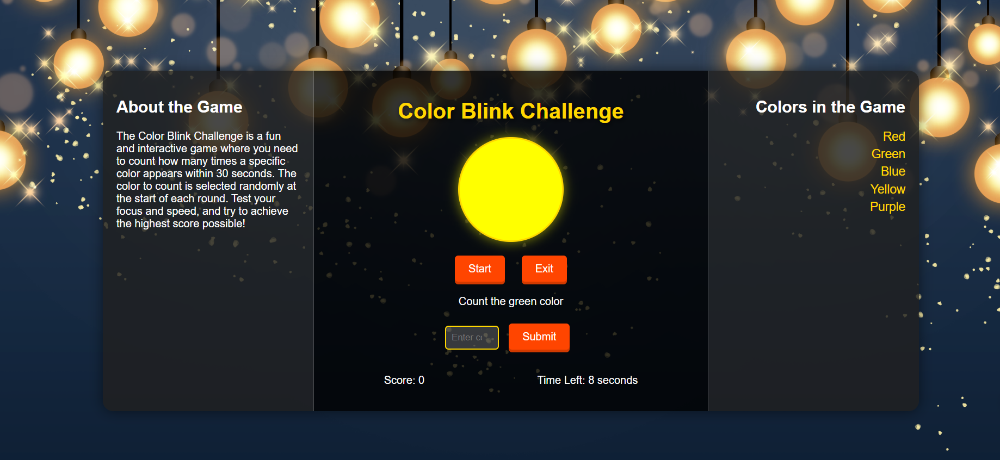

# About Game

The Color Blink Challenge is a fun and interactive game where you need to count how many times a specific color appears within 30 seconds. The color to count is selected randomly at the start of each round. Test your focus and speed, and try to achieve the highest score possible!

# Screenshot
