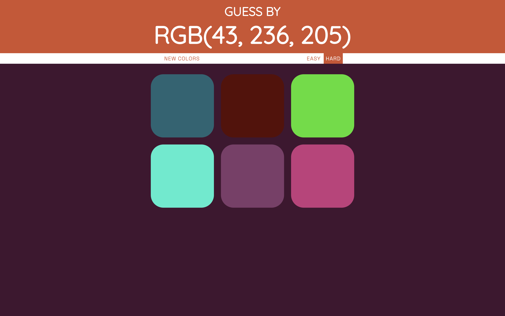

# **GUESS By RGB(r, g, b)**

---

 

## **Description 📃** 
- This game will check your estimation ability and your familiarity with the RGB color scheme.

## **functionalities 🎮** 
- random color generation
- fully responsive design
- 2 levels
 

## **How to play? 🕹️**
- the game has 2 levels, easy and hard.
    1. On picking hard, you will have to choose the closest match out of 6 options to the given RGB coordinates.
    2. On picking easy, you will have to choose the closest match out of 3 options to the given RGB coordinates.
    3. After picking the most accurate colour you win! 
    4. Click on play again to start over again. If you want to restart a game just click on 'new colors'.

 

## **Screenshots 📸**

 

 

## **Working video 📹**
<!-- add your working video over here -->
https://github.com/singh-anushka/GameZone/assets/93376863/48c8b665-4390-480d-a565-37f9e19f3c4e
