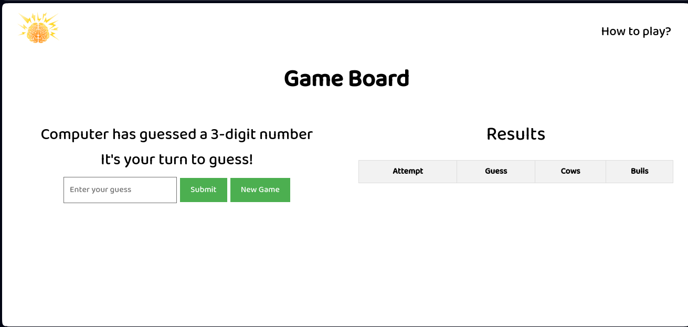

# **Crack The Code**

---

## **Description 📃**

<!-- add your game description here  -->

- The "Cows and Bulls" game is a classic code-breaking game where the player tries to guess a secret 3-digit number. The game provides feedback on each guess, indicating the number of "cows" and "bulls" in the guess.
- A "cow" represents a correct digit in the wrong position.
- A "bull" represents a correct digit in the correct position.
- The player has 10 attempts to guess the secret number correctly. After each guess, the game displays the number of cows and bulls, helping the player to refine their next guess.
- Have fun playing the "Cows and Bulls" game and see how quickly you can crack the code!

## **Functionalities 🎮**

<!-- add functionalities over here -->

- Generate 3 number code
- Provide hints in the form of "cows" and "bulls"
- Player's guess input
- Submit guess through a responsive web interface
- Check for correct submission
- If true, player wins; else, game restarts
- Loop continues until the player wins or exhausts their attempts

 

## **How to Play? 🕹️**

<!-- add the steps how to play games -->

1. The game generates a secret 3-digit number.
2. Enter your guess in the provided input field.
3. Submit your guess.
4. Review the feedback of "cows" and "bulls" to adjust your next guess.
5. Repeat steps 2-4 until you guess the number correctly or run out of attempts.
6. If you guess correctly within 10 attempts, you win! Otherwise, the game restarts.

 

## **Screenshots 📸**

 

## **Working video 📹**

<!-- add your working video over here -->
