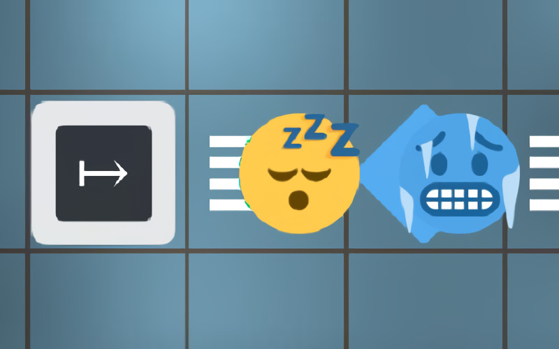

# **Cryonics_Inc** 

---

 

## **Description 📃**
- Help emojis beat death by using cryonics!
- This is an open ended puzzle game made as a tribute to Zachtronics games.

## **How to play? 🕹️**
- Instructions:
	- Place machines to freeze all emojis and move them into cryochambers (blue circles).
	- Large arrow: Moves object on it to next tile
	- Small arrow: Pushes an object in front of it to next tile
	- Blue diamond: Freezes object
	- White diamond: Unfreezes object
	- Red hexagon(in level editor): Simply blocks objects

- Controls:
	- Move - W, A, S, D
	- The game is controlled entirely by mouse/touch.
	
- Note:
	- Objects when frozen will get joined to any frozen objects near it.
	- The frozen objects must cover all cryochambers at the same time to get stored.

 

## **Screenshots 📸**

 

 
