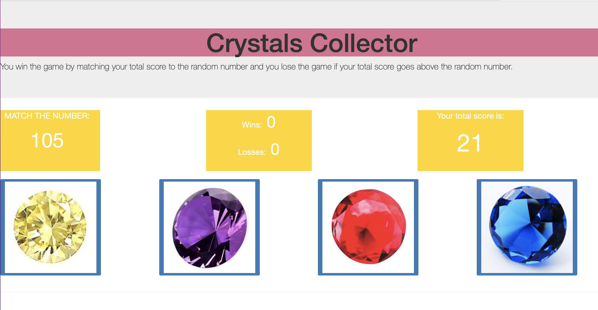

# **Crystals_Collector** 
---

 

## **Description 📃**
The Crystal Collector Game is a simple web-based game where players aim to match their total score to a randomly generated number by collecting crystals of varying values. The game provides an entertaining and interactive experience for users of all ages.
- 

## **functionalities 🎮**
The objective of the game is to match your total score to the randomly generated number. Players will be presented with a target number and a set of crystals, each associated with a specific value. By clicking on the crystals, players can increment their total score. The challenge is to strategically select crystals that will result in the desired total score without going over the target number.

  
- 
 

## **How to play? 🕹️**
Visit the game website or open the HTML file in a web browser.
The target number will be displayed at the top of the screen.
Click on the crystals to increment your total score.
Strategically select crystals to match your total score to the target number without going over.
If your total score matches the target number, you win the game. If it exceeds the target number, you lose.
The game will keep track of your wins and losses.  

 

## **Screenshots 📸**

 

 
