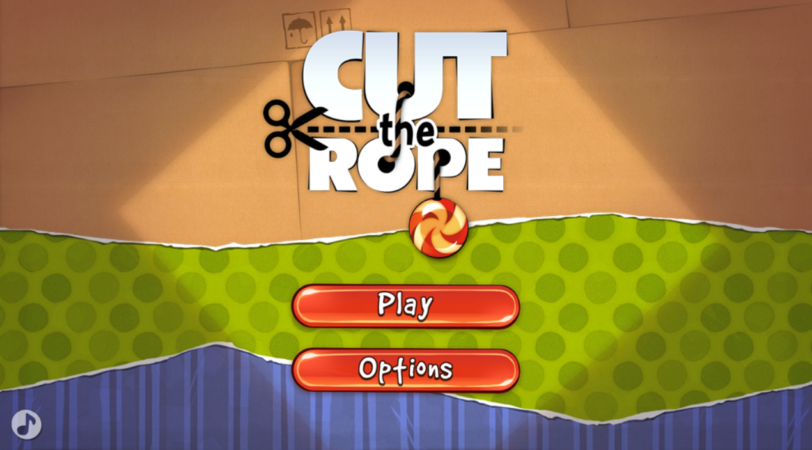

# **Game_Name** 
Cut the rope
---

 

## **Description 📃**
<!-- add your game description here  -->
Cut the rope is a clone of an android game that can be played on your browser. 
In this, a monster sits on a level and our aim is to feed him candy. 
- 

## **functionalities 🎮**
<!-- add functionalities over here -->
This web game stores progress on your local device so whenever you want to play this game it will not start from the beginning. 
Our aim is to feed the monster, a candy while collecting as much stars as possible. 
In a particular level you can collect max of 3 stars. 

  
- 
 

## **How to play? 🕹️**
<!-- add the steps how to play games -->
You have to use your mouse to play this game. 
Use the mouse to cut the rope so that candy falls directly to the monster. 
And like cutting the rope there are lot of functions like popping the bubble all are controlled by mouse.   

 

## **Screenshots 📸**

 
<!-- add your screenshots like this -->

 
