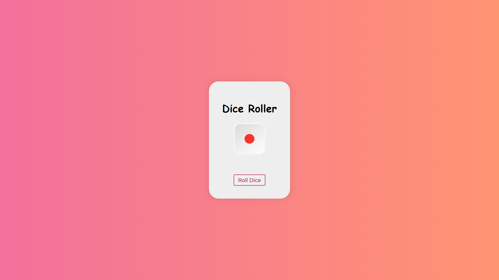

# Dice Roller Game 🎲

## Description 📃
The Dice Roller game is a simple and interactive web-based game built using HTML, CSS, and JavaScript. Players can roll a virtual 3D dice by clicking the "Roll Dice" button. The game features an animated dice that shows a random face on each roll, with a visually appealing design and gradient background that changes over time.

## Functionalities 🎮
- Click the "Roll Dice" button to roll the dice.
- Watch the dice animate and display a random face.
- User-friendly interface with attractive button styles.

## How to Play? 🕹️
1. Open the game in your web browser.
2. Click on the "Roll Dice" button to start rolling the dice.
3. The dice will animate and land on a random number between 1 and 6.
4. Enjoy the visual effects and try rolling the dice multiple times to see different results.
5. To roll the dice again, simply click the "Roll Dice" button.

## Screenshots 📸

