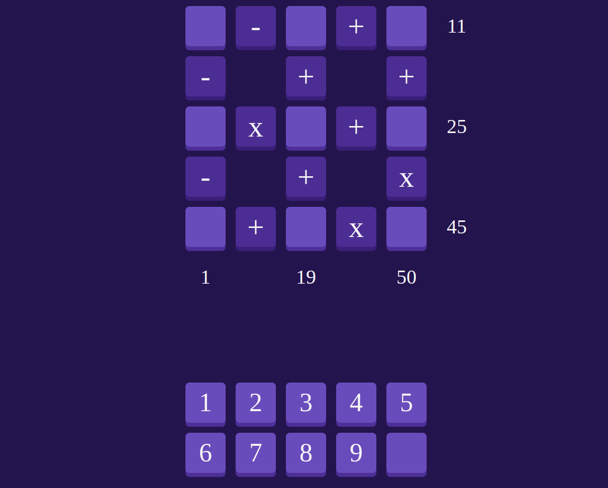

# **Digit Dilemma** 

## **Description**
This a classic game implemented using HTML, CSS, and JavaScript. This is a logic-based puzzle game where your objective is to fill a grid with the numbers 1 through 9, ensuring that the calculations formed by the numbers in the grid equal the given target numbers.

 

## **Functionalities**

- Random Number Generation: A random number within a specified range is generated for each game session, providing a unique challenge every time.
- Interactive Interface: The game provides an interactive interface where you can input your guesses and receive feedback on each guess.
- Visual Feedback: The interface visually highlights whether your guess is higher or lower than the target number, helping you refine your subsequent guesses.
- Winning Celebration: When you guess the correct number, the game celebrates your victory with a winning message and prompts you to play again.

 

## **How to play?**
To play the Mastermind game, follow these steps:

1. You will be presented with a 3x3 grid, initially empty, and a set of target numbers.
2. Your task is to place the numbers 1 through 9 into the grid, one number per cell, in such a way that the calculations formed by the numbers in the grid equal the target numbers.
3. The calculations follow a specific order: addition and subtraction are performed from left to right, and multiplication and division are performed from left to right as well.
4. The calculations in parentheses are not considered, and you should work left to right, top to bottom.
5. To place a number in a cell, click on the desired cell and select a number from the available options.
6. You can change your choice for a cell at any time by clicking on it again and selecting a different number.
7. The puzzle is solved when all the target numbers are matched correctly with the calculations in the grid.

 

## **Installation**
1. Clone or download the repository.
2. Open the index.html file in a web browser.

 

## **Screenshots 📸**

 

 

