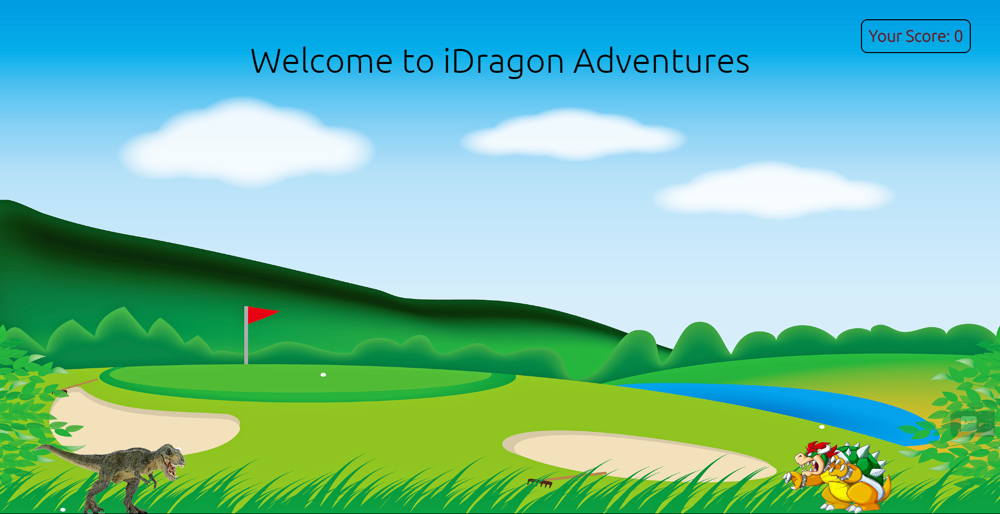

# **DINO_RUNNER**

---

 

## **Description 📃** 
- This is a retro styled 2D game in which you have to tackle the enemy by jumping in air, and the muskic makes it even more funnier ; `)`
**Your Chrome Dinosaur game, but with some twists.**

## **functionalities 🎮** 
- Easy to play
- Exciting sound effects to immerse you and keep you engaged. 
- Scoring system so that you can compare points with your fellow friends.
 

## **How to play? 🕹️**
- Your aim is to protect your dino from Bowser(enemy), you can easily control your dino with the help of arrow keys.
- The score keeps adding up evry time you successfully dodge the enemy.
- If you die, you can reload and start playing again.

 

## **Screenshots 📸**

 

 

## **Working video 📹**
<!-- add your working video over here -->
<figure class="video_container">
  <video controls="true" allowfullscreen="true" poster="path/to/poster_image.png">
    <source src="path/to/video.mp4" type="video/mp4">
    <source src="path/to/video.ogg" type="video/ogg">
    <source src="path/to/video.webm" type="video/webm">
  </video>
</figure>

## **Note**
!! The game is currently optimised to run on larger displays only, because of play area !!