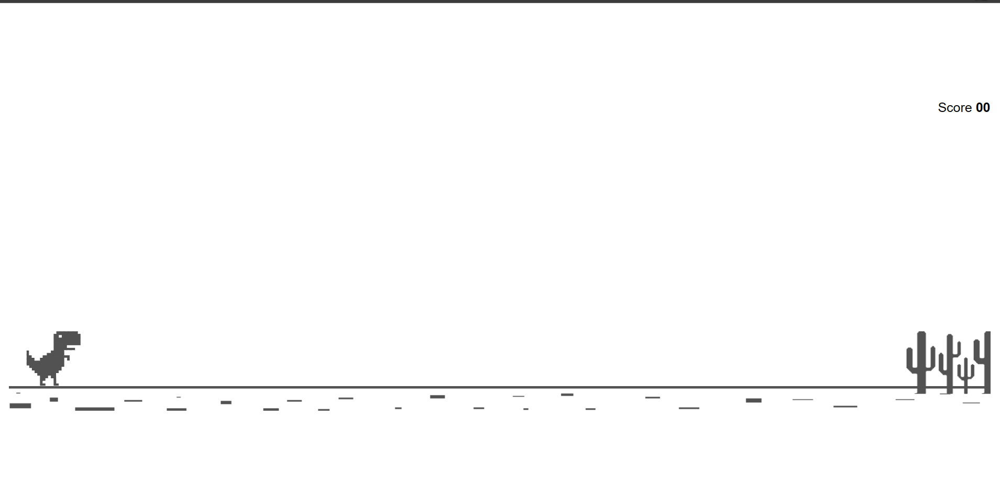
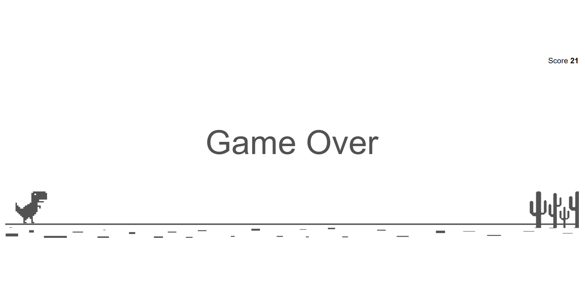

# The Dinosaur Game

## Description
The Dinosaur Game is a simple and addictive browser-based game. It's an endless runner game where you control a T-Rex and try to avoid cacti by jumping over them. The longer you survive, the higher your score!

## How to Play
1. Open the game in a web browser.
2. Press the spacebar or click anywhere on the screen to make the T-Rex jump.
3. Time your jumps to avoid colliding with the cacti.
4. The game will progressively get faster, making it more challenging to survive.
5. Your score increases as you successfully jump over the cacti.
6. The game ends when the T-Rex collides with a cactus.

## Technologies Used
- HTML
- CSS
- JavaScript

## Screenshots

