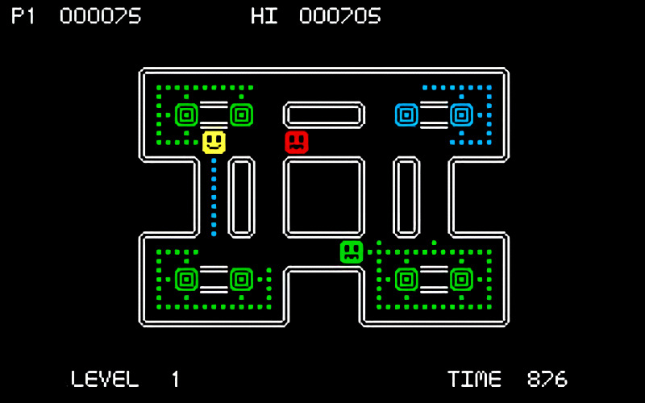

# **Disconnect_Maze** 

---

 

## **Description 📃**

- Disconnect the machines before being caught!

- This is simple (relatively incomplete!) simultaneous turn-based random maze game.  

## **How to play? 🕹️**
- Press Enter to start and use the Arrow keys to move.
- There are two kinds of baddies - 
	- Guards (Red) who move quickly and are out to catch you.
	- Engineers (Green) who are slow and just want to fix up the cables you break.

- The object of the game is to remove cables so that the machines (green blocks!) are disconnected from each other.
	
 

## **Screenshots 📸**

 

 
