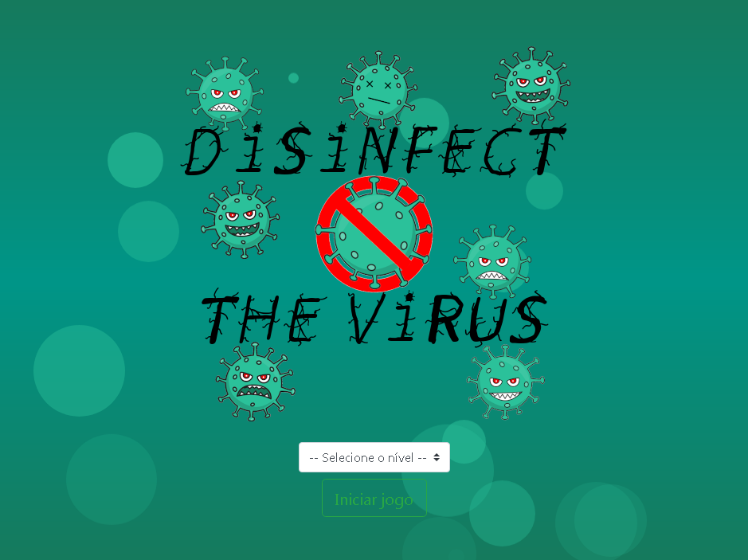
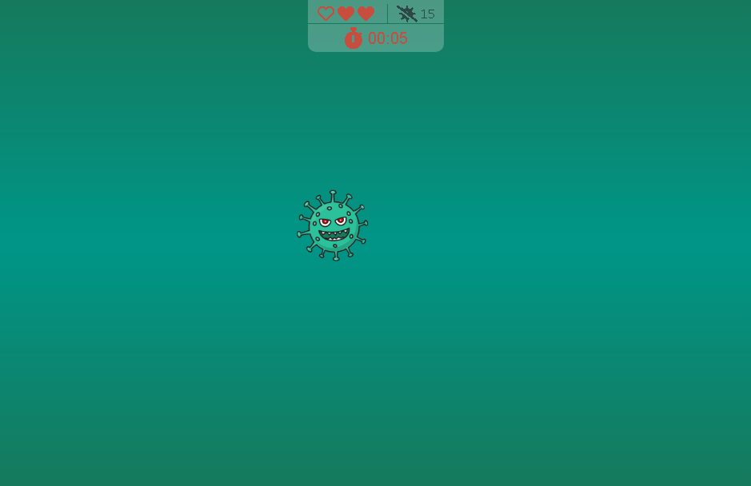

<p align="center">	
	<h1 align="center">Disinfect the virus</h1>
</p>
<p align="center">
    
</p>
    <p align="center"><em>Disinfect and eliminate all viruses.</em></p>
    <p align="center">
        
        
  	</p>
</p>

<p align="center">
	
	
</p>

## Translations :triangular_flag_on_post:

* :brazil: [Original](https://github.com/JefersonLucas/disinfect-the-virus/blob/master/README.md)
* :us: [English](https://github.com/JefersonLucas/disinfect-the-virus/blob/master/translations/en/README.md)

### Starting :heavy_check_mark:

These instructions will provide a copy of the project running on your local machine.

#### Cloning the repository

Start the repository on your local machine using the command lines.

```
#Clone with SSH

mkdir disinfect-the-virus
cd disinfect-the-virus
git init
git clone git@github.com:JefersonLucas/disinfect-the-virus.git
```

```
#Clone with HTTPS

mkdir disinfect-the-virus
cd disinfect-the-virus
git init
git clone https://github.com/JefersonLucas/disinfect-the-virus.git
```
The files that are in the remote repository are now cloned into the local repository.

#### Downloading the repository

You can also [download](https://github.com/JefersonLucas/disinfect-the-virus/archive/master.zip) the repository in zip format.

## Environment :desktop_computer:

See here the page of the project deployed by@github-pages [view deployment](https://jefersonlucas.github.io/disinfect-the-virus/).

## Construído com :building_construction:

* [Bootstrap](https://getbootstrap.com/) - Framework front end.
* [Dafont](https://www.dafont.com/virus-2.font) - Banco de fontes.
* [Font Awesome](https://fontawesome.com/) - Framework de pacote de ícones.
* [pngtree](https://pngtree.com/so/micróbios-bacterianos) - Banco de imagens.

## Contributing :up:

Read the [CONTRIBUTING.md](https://github.com/JefersonLucas/disinfect-the-virus/blob/master/CONTRIBUTING.md) for details on our code of conduct and the process for submitting pull requests to us.

## Versioning :label:

We use the [SemVer](https://semver.org) for version control. For available versions, see the [tags in this repository](https://github.com/JefersonLucas/disinfect-the-virus/tags). 

## Authors :pray:

* **Jeferson Lucas** - *Trabalho Inicial* - [JefersonLucas](https://github.com/JefersonLucas).

Veja também a lista de [contribuidores](https://github.com/JefersonLucas/disinfect-the-virus/contributors) que participaram deste projeto.

## License :copyright:

This project is licensed under the MIT license - see the archive [LICENSE.md](https://github.com/JefersonLucas/disinfect-the-virus/blob/master/LICENSE) for details.

## Thanks :clap:

My sincere thanks:

* first to God.
* Project contributors.
* Everyone who visits the project and leaves a star as recognition.
* To my teacher [Jorge Sant Ana](https://twitter.com/jorgesantanabr) for inspiration.
