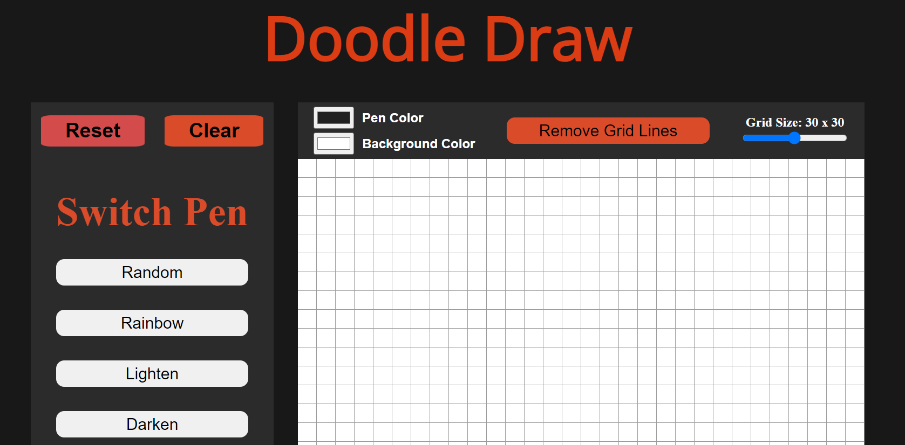
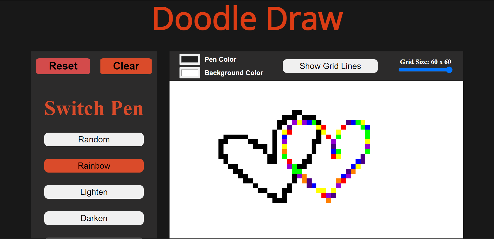

# **Doodle Draw** 

---

 
Let`s Draw !!

## **Description 📃**.
Doodle Draw will unleash your creativity and create pixelated artwork on a virtual canvas. With various customization options and features, you can paint, draw, and experiment to your heart's content.
Let your imagination soar as you bring your ideas to life, one pixel at a time.

## **functionalities 🎮**
The game is designed using Html, CSS, and javascript.

 

## **How to play? 🕹️**
- Choose your favorite the color and background (Default for black & white), then hold the mouse inside the grid to paint
- Features
  - Clear: Clear the board
  - Reset: Reset all to default
  - Toggle `random` & `rainbow` button the pixels color will be random
  - Toggle `darken` & `lighten` slowly turns cell into black & white
  - Toggle `eraser` to clear the cell color
  - `Specific Area` used to fill specific area and `Full Area` used to fill full area
  - Slice `grid size` will change the resolution of the screen (# of pixels). Depend on what you want
  - You can customize pencil and background color by pressing `pen color` & `blackground color`
  - If you want to remove grid line, just click `Remove Grid Lines` button
- 
- 

 

## **Screenshots 📸**

 
 

