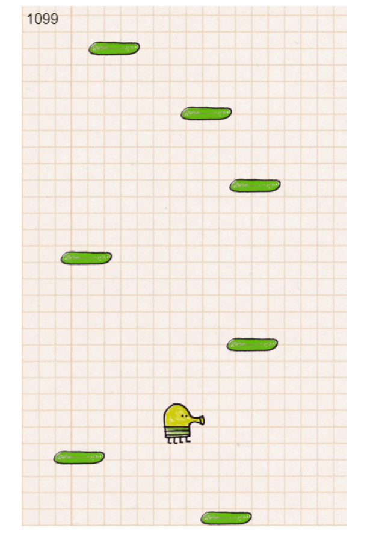

# **Doodle_Jump** 

---

 

## **Description 📃**
<!-- add your game description here  -->

- The gameplay in Doodle Jump is straightforward. Players control the Doodler by tilting their device or using on-screen controls to move horizontally across the screen. The Doodler automatically jumps upward, and the player's task is to guide the character onto platforms to keep ascending.

## **functionalities 🎮**
<!-- add functionalities over here -->
- Tilting Controls: Players can control the Doodler's movement by tilting their device left or right. Alternatively, some versions of the game also provide on-screen touch controls for horizontal movement.
-Platform Variety: Doodle Jump features a wide range of platforms, including solid platforms, crumbling platforms, moving platforms, and spring-loaded platforms. Each type of platform presents its own challenges and requires different strategies to navigate.
-Power-ups: Throughout the game, players can collect various power-ups to aid their ascent. These power-ups can provide benefits like increased jump height, temporary invincibility, jetpacks for controlled flight, trampolines for higher jumps, and more.
-Obstacles: Alongside platforms, players will encounter obstacles that they need to avoid or overcome. These obstacles include monsters, UFOs, and other enemies that can hinder progress or cause the player to lose the game.
-Scoring: The objective is to climb as high as possible while collecting points. Points are earned by reaching higher platforms, collecting power-ups, defeating enemies, and performing combos (stringing together multiple successful jumps without landing on a platform).
 

## **How to play? 🕹️**
<!-- add the steps how to play games -->
- Start the Game: Launch the Doodle Jump app on your mobile device.
-Control the Doodler: Tilt your device left or right to move the Doodler horizontally. Alternatively, use the on-screen touch controls if available.
-Ascend and Land on Platforms: The Doodler automatically jumps upward, and your goal is to guide them onto platforms. Tilt your device to align the Doodler with the platforms and ensure a safe landing. Be cautious of platform types, as some may crumble or move.
-Collect Power-ups: As you ascend, collect power-ups that appear on the screen. These power-ups provide temporary advantages and can help you climb higher.
Avoid Obstacles: Watch out for enemies and obstacles that can impede your progress. Try to avoid them or defeat them if possible.
-Maintain Momentum: To achieve higher scores, try to maintain a continuous flow of jumps without pauses. Successfully landing on multiple platforms in quick succession without falling increases your combo score.
-Game Over: The game ends if you fall off the screen or collide with an enemy. Your score is recorded, and you can aim to beat it in subsequent attempts.

 

## **Screenshots 📸**

 
<!-- add your screenshots like this -->
<!--  -->

 

## **Working video 📹**
<!-- add your working video over here -->